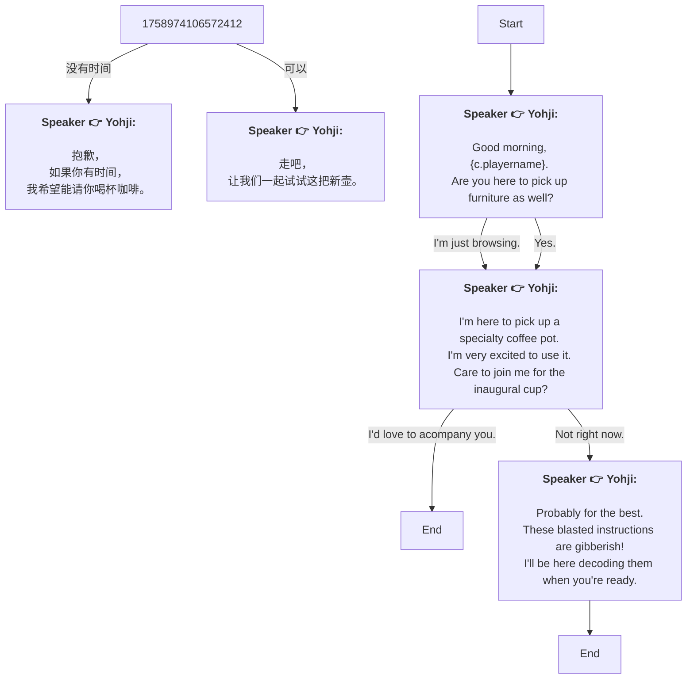

```mermaid
graph
1758974106572412 -->|没有时间|1758974898523781[<b>Speaker 👉 Yohji:</b>
\n抱歉，
如果你有时间，
我希望能请你喝杯咖啡。]
1758974106572412 -->|可以|1758974862427780[<b>Speaker 👉 Yohji:</b>
\n走吧，
让我们一起试试这把新壶。]
Start -->1772870341373218[<b>Speaker 👉 Yohji:</b>
\nGood morning, &lbrace;c.playername&rbrace;. 
Are you here to pick up furniture as well?]
1772870341373218 -->|I'm just browsing.|1772870377515304[<b>Speaker 👉 Yohji:</b>
\nI'm here to pick up a specialty coffee pot. 
I'm very excited to use it. 
Care to join me for the inaugural cup?]
1772870341373218 -->|Yes.|1772870377515304[<b>Speaker 👉 Yohji:</b>
\nI'm here to pick up a specialty coffee pot. 
I'm very excited to use it. 
Care to join me for the inaugural cup?]
1772870377515304 -->|I'd love to acompany you.|1772870517681456[End]
1772870377515304 -->|Not right now.|1772870422685998[<b>Speaker 👉 Yohji:</b>
\nProbably for the best.
These blasted instructions are gibberish!
I'll be here decoding them when you're ready.]
1772870422685998 -->1772870499052847[End]

```