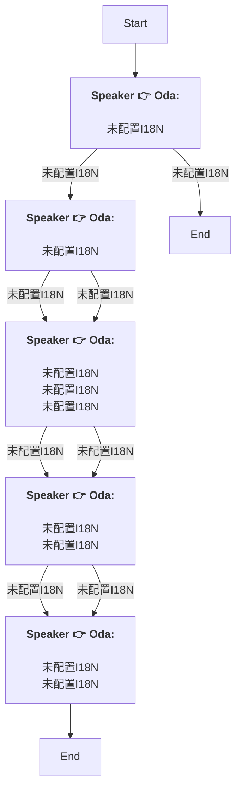

```mermaid
graph
Start -->1761994565016202[<b>Speaker 👉 Oda:</b>
\n未配置I18N]
1761994565016202 -->|未配置I18N|1761995505944210[<b>Speaker 👉 Oda:</b>
\n未配置I18N]
1761994565016202 -->|未配置I18N|1761995118851729[End]
1761995505944210 -->|未配置I18N|1761995693570712[<b>Speaker 👉 Oda:</b>
\n未配置I18N\n未配置I18N\n未配置I18N]
1761995505944210 -->|未配置I18N|1761995693570712[<b>Speaker 👉 Oda:</b>
\n未配置I18N\n未配置I18N\n未配置I18N]
1761995693570712 -->|未配置I18N|1761996012354207[<b>Speaker 👉 Oda:</b>
\n未配置I18N\n未配置I18N]
1761995693570712 -->|未配置I18N|1761996012354207[<b>Speaker 👉 Oda:</b>
\n未配置I18N\n未配置I18N]
1761996012354207 -->|未配置I18N|1761996076811946[<b>Speaker 👉 Oda:</b>
\n未配置I18N\n未配置I18N]
1761996012354207 -->|未配置I18N|1761996076811946[<b>Speaker 👉 Oda:</b>
\n未配置I18N\n未配置I18N]
1761996076811946 -->1761995115106960[End]

```