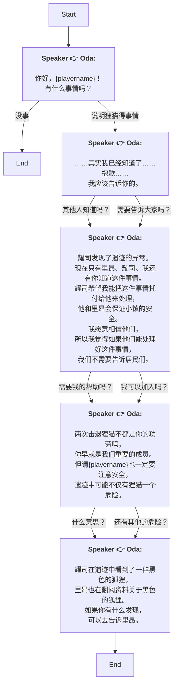

```mermaid
graph
Start -->1761994565016202[<b>Speaker 👉 Oda:</b>
\n你好，&lbrace;playername&rbrace;！
有什么事情吗？]
1761994565016202 -->|没事|1761995118851729[End]
1761994565016202 -->|说明狸猫得事情|1761995505944210[<b>Speaker 👉 Oda:</b>
\n……其实我已经知道了……
抱歉……
我应该告诉你的。]
1761995505944210 -->|其他人知道吗？|1761995693570712[<b>Speaker 👉 Oda:</b>
\n耀司发现了遗迹的异常。
现在只有里昂、耀司、我还有你知道这件事情。\n耀司希望我能把这件事情托付给他来处理，
他和里昂会保证小镇的安全。\n我愿意相信他们，
所以我觉得如果他们能处理好这件事情，
我们不需要告诉居民们。]
1761995505944210 -->|需要告诉大家吗？|1761995693570712[<b>Speaker 👉 Oda:</b>
\n耀司发现了遗迹的异常。
现在只有里昂、耀司、我还有你知道这件事情。\n耀司希望我能把这件事情托付给他来处理，
他和里昂会保证小镇的安全。\n我愿意相信他们，
所以我觉得如果他们能处理好这件事情，
我们不需要告诉居民们。]
1761995693570712 -->|需要我的帮助吗？|1761996012354207[<b>Speaker 👉 Oda:</b>
\n两次击退狸猫不都是你的功劳吗，
你早就是我们重要的成员。\n但请&lbrace;playername&rbrace;也一定要注意安全，
遗迹中可能不仅有狸猫一个危险。]
1761995693570712 -->|我可以加入吗？|1761996012354207[<b>Speaker 👉 Oda:</b>
\n两次击退狸猫不都是你的功劳吗，
你早就是我们重要的成员。\n但请&lbrace;playername&rbrace;也一定要注意安全，
遗迹中可能不仅有狸猫一个危险。]
1761996012354207 -->|什么意思？|1761996076811946[<b>Speaker 👉 Oda:</b>
\n耀司在遗迹中看到了一群黑色的狐狸，
里昂也在翻阅资料关于黑色的狐狸。\n如果你有什么发现，
可以去告诉里昂。]
1761996012354207 -->|还有其他的危险？|1761996076811946[<b>Speaker 👉 Oda:</b>
\n耀司在遗迹中看到了一群黑色的狐狸，
里昂也在翻阅资料关于黑色的狐狸。\n如果你有什么发现，
可以去告诉里昂。]
1761996076811946 -->1761995115106960[End]

```