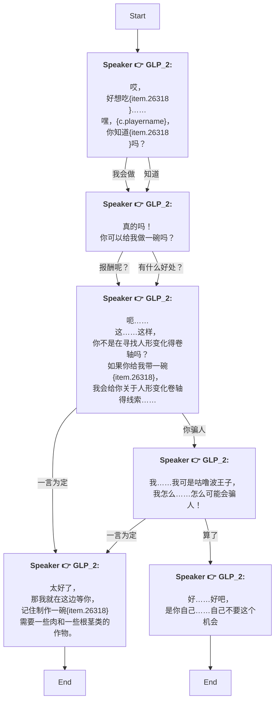

```mermaid
graph
Start -->1761998885248731[<b>Speaker 👉 GLP_2:</b>
\n哎，
好想吃&lbrace;item.26318
&rbrace;……\n嘿，&lbrace;c.playername&rbrace;，
你知道&lbrace;item.26318
&rbrace;吗？]
1761998885248731 -->|我会做|1761999334936289[<b>Speaker 👉 GLP_2:</b>
\n真的吗！
你可以给我做一碗吗？]
1761998885248731 -->|知道|1761999334936289[<b>Speaker 👉 GLP_2:</b>
\n真的吗！
你可以给我做一碗吗？]
1761999334936289 -->|报酬呢？|1761999398122215[<b>Speaker 👉 GLP_2:</b>
\n呃……
这……这样，
你不是在寻找人形变化得卷轴吗？\n如果你给我带一碗&lbrace;item.26318&rbrace;，
我会给你关于人形变化卷轴得线索……]
1761999334936289 -->|有什么好处？|1761999398122215[<b>Speaker 👉 GLP_2:</b>
\n呃……
这……这样，
你不是在寻找人形变化得卷轴吗？\n如果你给我带一碗&lbrace;item.26318&rbrace;，
我会给你关于人形变化卷轴得线索……]
1761999398122215 -->|一言为定|1761999863779073[<b>Speaker 👉 GLP_2:</b>
\n太好了，
那我就在这边等你，
记住制作一碗&lbrace;item.26318&rbrace;需要一些肉和一些根茎类的作物。]
1761999398122215 -->|你骗人|1761999809644288[<b>Speaker 👉 GLP_2:</b>
\n我……我可是咕噜波王子，
我怎么……怎么可能会骗人！]
1761999809644288 -->|算了|1761999976316682[<b>Speaker 👉 GLP_2:</b>
\n好……好吧，
是你自己……自己不要这个机会]
1761999809644288 -->|一言为定|1761999863779073[<b>Speaker 👉 GLP_2:</b>
\n太好了，
那我就在这边等你，
记住制作一碗&lbrace;item.26318&rbrace;需要一些肉和一些根茎类的作物。]
1761999863779073 -->1761999770123007[End]
1761999976316682 -->1761999964552969[End]

```