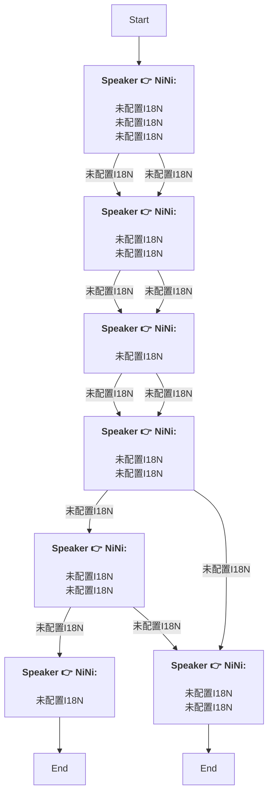

```mermaid
graph
Start -->1766053515595483[<b>Speaker 👉 NiNi:</b>
\n未配置I18N\n未配置I18N\n未配置I18N]
1766053515595483 -->|未配置I18N|1766055012627169[<b>Speaker 👉 NiNi:</b>
\n未配置I18N\n未配置I18N]
1766053515595483 -->|未配置I18N|1766055012627169[<b>Speaker 👉 NiNi:</b>
\n未配置I18N\n未配置I18N]
1766055012627169 -->|未配置I18N|1766056153452252[<b>Speaker 👉 NiNi:</b>
\n未配置I18N]
1766055012627169 -->|未配置I18N|1766056153452252[<b>Speaker 👉 NiNi:</b>
\n未配置I18N]
1766056153452252 -->|未配置I18N|1766056200126178[<b>Speaker 👉 NiNi:</b>
\n未配置I18N\n未配置I18N]
1766056153452252 -->|未配置I18N|1766056200126178[<b>Speaker 👉 NiNi:</b>
\n未配置I18N\n未配置I18N]
1766056200126178 -->|未配置I18N|1766056329715434[<b>Speaker 👉 NiNi:</b>
\n未配置I18N\n未配置I18N]
1766056200126178 -->|未配置I18N|1766056269282024[<b>Speaker 👉 NiNi:</b>
\n未配置I18N\n未配置I18N]
1766056269282024 -->1766056308926185[End]
1766056329715434 -->|未配置I18N|1766056401217265[<b>Speaker 👉 NiNi:</b>
\n未配置I18N]
1766056329715434 -->|未配置I18N|1766056269282024[<b>Speaker 👉 NiNi:</b>
\n未配置I18N\n未配置I18N]
1766056401217265 -->1766056390392560[End]

```