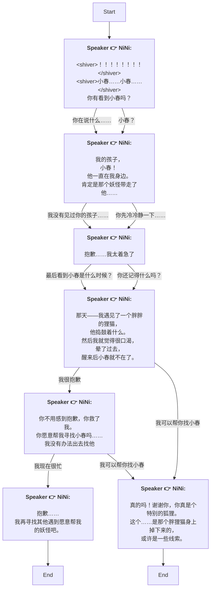

```mermaid
graph
Start -->1766053515595483[<b>Speaker 👉 NiNi:</b>
\n&lt;shiver&gt;！！！！！！！！&lt;/shiver&gt;\n&lt;shiver&gt;小春……小春……&lt;/shiver&gt;\n你有看到小春吗？]
1766053515595483 -->|你在说什么……|1766055012627169[<b>Speaker 👉 NiNi:</b>
\n我的孩子，
小春！ 
他一直在我身边。\n肯定是那个妖怪带走了他……]
1766053515595483 -->|小春？|1766055012627169[<b>Speaker 👉 NiNi:</b>
\n我的孩子，
小春！ 
他一直在我身边。\n肯定是那个妖怪带走了他……]
1766055012627169 -->|我没有见过你的孩子……|1766056153452252[<b>Speaker 👉 NiNi:</b>
\n抱歉……我太着急了]
1766055012627169 -->|你先冷冷静一下……|1766056153452252[<b>Speaker 👉 NiNi:</b>
\n抱歉……我太着急了]
1766056153452252 -->|最后看到小春是什么时候？|1766056200126178[<b>Speaker 👉 NiNi:</b>
\n那天——我遇见了一个胖胖的狸猫，
他捣鼓着什么。\n然后我就觉得很口渴，
晕了过去，
醒来后小春就不在了。]
1766056153452252 -->|你还记得什么吗？|1766056200126178[<b>Speaker 👉 NiNi:</b>
\n那天——我遇见了一个胖胖的狸猫，
他捣鼓着什么。\n然后我就觉得很口渴，
晕了过去，
醒来后小春就不在了。]
1766056200126178 -->|我很抱歉|1766056329715434[<b>Speaker 👉 NiNi:</b>
\n你不用感到抱歉，你救了我。\n你愿意帮我寻找小春吗……
我没有办法出去找他]
1766056200126178 -->|我可以帮你找小春|1766056269282024[<b>Speaker 👉 NiNi:</b>
\n真的吗！谢谢你，你真是个特别的狐狸。\n这个……是那个胖狸猫身上掉下来的，
或许是一些线索。]
1766056269282024 -->1766056308926185[End]
1766056329715434 -->|我现在很忙|1766056401217265[<b>Speaker 👉 NiNi:</b>
\n抱歉……
我再寻找其他遇到愿意帮我的妖怪吧。]
1766056329715434 -->|我可以帮你找小春|1766056269282024[<b>Speaker 👉 NiNi:</b>
\n真的吗！谢谢你，你真是个特别的狐狸。\n这个……是那个胖狸猫身上掉下来的，
或许是一些线索。]
1766056401217265 -->1766056390392560[End]

```