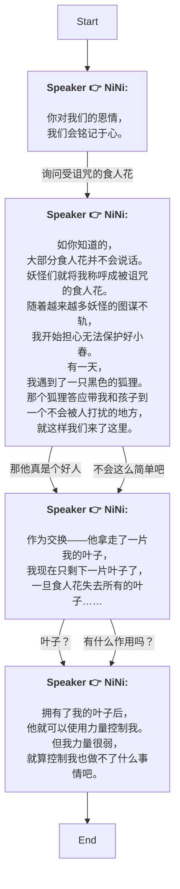

```mermaid
graph
Start -->1766067178303239[<b>Speaker 👉 NiNi:</b>
\n你对我们的恩情，
我们会铭记于心。]
1766067178303239 -->|询问受诅咒的食人花|1766067230958349[<b>Speaker 👉 NiNi:</b>
\n如你知道的，
大部分食人花并不会说话。\n妖怪们就将我称呼成被诅咒的食人花。\n随着越来越多妖怪的图谋不轨，
我开始担心无法保护好小春。\n有一天，
我遇到了一只黑色的狐狸。\n那个狐狸答应带我和孩子到一个不会被人打扰的地方，
就这样我们来了这里。]
1766067230958349 -->|那他真是个好人|1766067445982995[<b>Speaker 👉 NiNi:</b>
\n作为交换——他拿走了一片我的叶子，
我现在只剩下一片叶子了，
一旦食人花失去所有的叶子……]
1766067230958349 -->|不会这么简单吧|1766067445982995[<b>Speaker 👉 NiNi:</b>
\n作为交换——他拿走了一片我的叶子，
我现在只剩下一片叶子了，
一旦食人花失去所有的叶子……]
1766067445982995 -->|叶子？|1766067522114329[<b>Speaker 👉 NiNi:</b>
\n拥有了我的叶子后，
他就可以使用力量控制我。\n但我力量很弱，
就算控制我也做不了什么事情吧。]
1766067445982995 -->|有什么作用吗？|1766067522114329[<b>Speaker 👉 NiNi:</b>
\n拥有了我的叶子后，
他就可以使用力量控制我。\n但我力量很弱，
就算控制我也做不了什么事情吧。]
1766067522114329 -->1766067559968538[End]

```