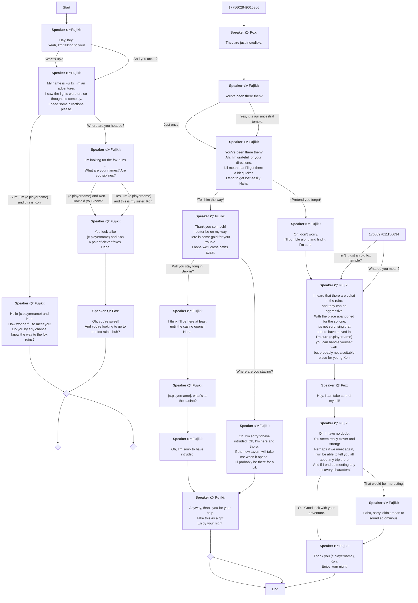

```mermaid
graph
Start -->1768096637256321[<b>Speaker 👉 Fujiki:</b>
\nHey, hey!
Yeah, I’m talking to you!]
1768096637256321 -->|What’s up?|1768096699678344[<b>Speaker 👉 Fujiki:</b>
\nMy name is Fujiki, I’m an adventurer.
I saw the lights were on, so thought I’d come by.
I need some directions please.]
1768096637256321 -->|And you are…?|1768096699678344[<b>Speaker 👉 Fujiki:</b>
\nMy name is Fujiki, I’m an adventurer.
I saw the lights were on, so thought I’d come by.
I need some directions please.]
1768096699678344 -->|Where are you headed?|1775602677821966[<b>Speaker 👉 Fujiki:</b>
\nI’m looking for the fox ruins.
…
What are your names? Are you siblings?]
1768096699678344 -->|Sure, I’m &lbrace;c.playername&rbrace; and this is Kon.|1768096751167118[<b>Speaker 👉 Fujiki:</b>
\nHello &lbrace;c.playername&rbrace; and Kon.
How wonderful to meet you!\nDo you by any chance know the way to the fox ruins?]
1768096751167118 -->1768096807608976{ }
1768096807608976 -->1768097003165337{ }
1768096807608976 -->1768096783748751{ }
1768098708092799 -->|Where are you staying?|1775604410976951[<b>Speaker 👉 Fujiki:</b>
\nOh, I’m sorry tohave intruded. Oh, I’m here and there. 
If the new tavern will take me when it opens, 
I’ll probably be there for a bit.]
1768098708092799 -->|Will you stay long in Seikyu?|1775604232847021[<b>Speaker 👉 Fujiki:</b>
\nI think I’ll be here at least until the casino opens! Haha.]
1775604232847021 -->1775604344854193[<b>Speaker 👉 Fujiki:</b>
\n&lbrace;c.playername&rbrace;, what’s at the casino?]
1775604344854193 -->1775604364893876[<b>Speaker 👉 Fujiki:</b>
\nOh, I’m sorry to have intruded.]
1775604364893876 -->1775604423722682[<b>Speaker 👉 Fujiki:</b>
\nAnyway, thank you for your help.
Take this as a gift,
Enjoy your night.]
1775604423722682 -->1768102595985288{ }
1768102595985288 -->1768100975726470[End]
1768102595985288 -->1768100975726470[End]
1775604410976951 -->1775604423722682[<b>Speaker 👉 Fujiki:</b>
\nAnyway, thank you for your help.
Take this as a gift,
Enjoy your night.]
1775602849016366 -->1775602858398260[<b>Speaker 👉 Fox:</b>
\nThey are just incredible.]
1775602858398260 -->1775602899668535[<b>Speaker 👉 Fujiki:</b>
\nYou’ve been there then?]
1775602899668535 -->|Just once.|1775603011898945[<b>Speaker 👉 Fujiki:</b>
\nYou’ve been there then?Ah, I’m grateful for your directions.
It’ll mean that I’ll get there a bit quicker.
I tend to get lost easily. Haha.]
1775602899668535 -->|Yes, it is our ancestral temple.|1775603011898945[<b>Speaker 👉 Fujiki:</b>
\nYou’ve been there then?Ah, I’m grateful for your directions.
It’ll mean that I’ll get there a bit quicker.
I tend to get lost easily. Haha.]
1775603011898945 -->|*Tell him the way*|1768098708092799[<b>Speaker 👉 Fujiki:</b>
\nThank you so much!
I better be on my way.\nHere is some gold for your trouble.
I hope we’ll cross paths again.]
1775603011898945 -->|*Pretend you forget*|1775603892698780[<b>Speaker 👉 Fujiki:</b>
\nOh, don’t worry.
I’ll bumble along and find it, I’m sure.]
1775603892698780 -->1775603527389774[<b>Speaker 👉 Fujiki:</b>
\nI heard that there are yokai in the ruins,
and they can be aggressive.\nWith the place abandoned for the so long,
it’s not surprising that others have moved in.\nI’m sure &lbrace;c.playername&rbrace; you can handle yourself well, 
but probably not a suitable place for young Kon.]
1775603527389774 -->1775603726191235[<b>Speaker 👉 Fox:</b>
\nHey, I can take care of myself!]
1775603726191235 -->1775603746253448[<b>Speaker 👉 Fujiki:</b>
\nOh, I have no doubt.
You seem really clever and strong!\nPerhaps if we meet again, 
I will be able to tell you all about my trip there.
And if I end up meeting any unsavory characters!]
1775603746253448 -->|Ok. Good luck with your adventure.|1775603829306008[<b>Speaker 👉 Fujiki:</b>
\nThank you &lbrace;c.playername&rbrace;, Kon. 
Enjoy your night!]
1775603746253448 -->|That would be interesting.|1775603811444372[<b>Speaker 👉 Fujiki:</b>
\nHaha, sorry, didn’t mean to sound so ominous.]
1775603811444372 -->1775603829306008[<b>Speaker 👉 Fujiki:</b>
\nThank you &lbrace;c.playername&rbrace;, Kon. 
Enjoy your night!]
1775603829306008 -->1768100975726470[End]
1768097011156634 -->|Isn’t it just an old fox temple?|1775603527389774[<b>Speaker 👉 Fujiki:</b>
\nI heard that there are yokai in the ruins,
and they can be aggressive.\nWith the place abandoned for the so long,
it’s not surprising that others have moved in.\nI’m sure &lbrace;c.playername&rbrace; you can handle yourself well, 
but probably not a suitable place for young Kon.]
1768097011156634 -->|What do you mean?|1775603527389774[<b>Speaker 👉 Fujiki:</b>
\nI heard that there are yokai in the ruins,
and they can be aggressive.\nWith the place abandoned for the so long,
it’s not surprising that others have moved in.\nI’m sure &lbrace;c.playername&rbrace; you can handle yourself well, 
but probably not a suitable place for young Kon.]
1775602677821966 -->|&lbrace;c.playername&rbrace; and Kon. How did you know?|1775602708264473[<b>Speaker 👉 Fujiki:</b>
\nYou look alike &lbrace;c.playername&rbrace; and Kon.
A pair of clever foxes. Haha.]
1775602677821966 -->|Yes, I’m &lbrace;c.playername&rbrace; and this is my sister, Kon.|1775602708264473[<b>Speaker 👉 Fujiki:</b>
\nYou look alike &lbrace;c.playername&rbrace; and Kon.
A pair of clever foxes. Haha.]
1775602708264473 -->1775602748246556[<b>Speaker 👉 Fox:</b>
\nOh, you’re sweet!
And you’re looking to go to the fox ruins, huh?]
1775602748246556 -->1768096807608976{ }

```