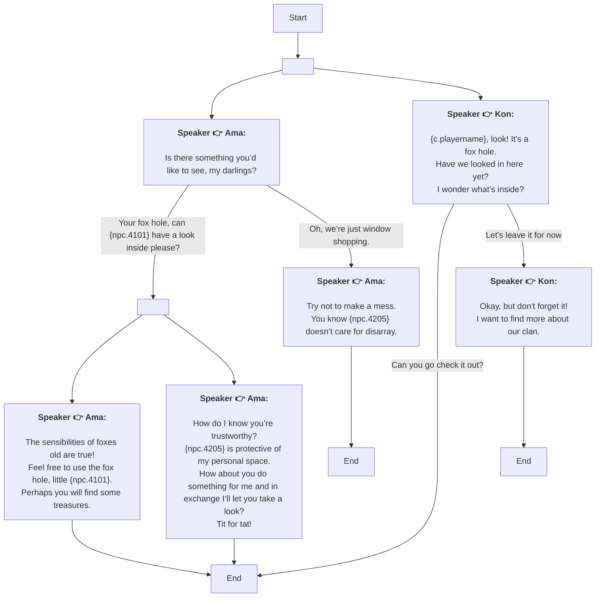

```mermaid
graph
Start -->1778103456528013[ ]
1778103456528013 -->1778103575711375[<b>Speaker 👉 Ama:</b>
\nIs there something you’d like to see, my darlings?]
1778103456528013 -->1778103427255928[<b>Speaker 👉 Kon:</b>
\n&lbrace;c.playername&rbrace;, look! It’s a fox hole.
Have we looked in here yet?
I wonder what’s inside?]
1778103427255928 -->|Can you go check it out?|1778103427259012[End]
1778103427255928 -->|Let's leave it for now|1778103427257984[<b>Speaker 👉 Kon:</b>
\nOkay, but don't forget it!
I want to find more about our clan.]
1778103427257984 -->1778103427257987[End]
1778103575711375 -->|Your fox hole, can &lbrace;npc.4101&rbrace; have a look inside please?|1778103500867214[ ]
1778103575711375 -->|Oh, we’re just window shopping.|1778103627516565[<b>Speaker 👉 Ama:</b>
\nTry not to make a mess.
You know &lbrace;npc.4205&rbrace; doesn’t care for disarray.]
1778103627516565 -->1778103640093335[End]
1778103500867214 -->1778103664573080[<b>Speaker 👉 Ama:</b>
\nThe sensibilities of foxes old are true!
Feel free to use the fox hole, little &lbrace;npc.4101&rbrace;.
Perhaps you will find some treasures.]
1778103500867214 -->1778103699633819[<b>Speaker 👉 Ama:</b>
\nHow do I know you’re trustworthy?
&lbrace;npc.4205&rbrace; is protective of my personal space.\nHow about you do something for me and in exchange I’ll let you take a look?
Tit for tat!]
1778103664573080 -->1778103427259012[End]
1778103699633819 -->1778103427259012[End]

```