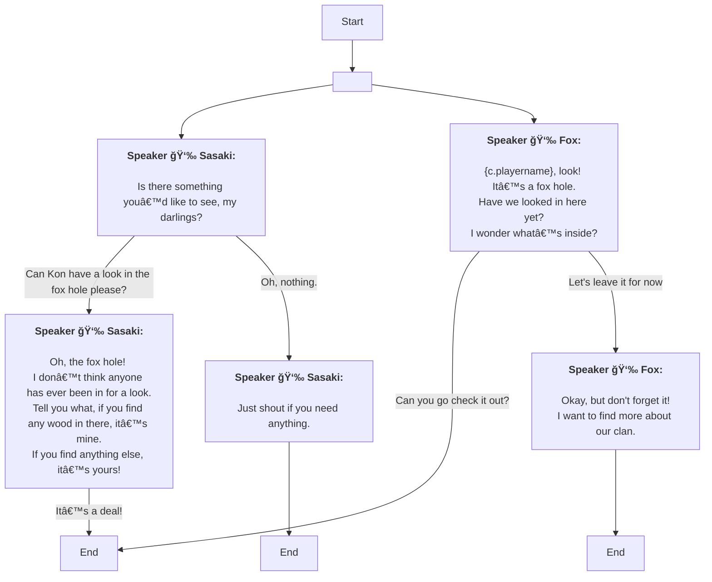

```mermaid
graph
Start -->1778104882951888[ ]
1778104882951888 -->1778104882955998[<b>Speaker 👉 Sasaki:</b>
\nIs there something you’d like to see, my darlings?]
1778104882951888 -->1778104882952913[<b>Speaker 👉 Fox:</b>
\n&lbrace;c.playername&rbrace;, look! It’s a fox hole.
Have we looked in here yet?
I wonder what’s inside?]
1778104882952913 -->|Can you go check it out?|1778104882954973[End]
1778104882952913 -->|Let's leave it for now|1778104882953945[<b>Speaker 👉 Fox:</b>
\nOkay, but don't forget it!
I want to find more about our clan.]
1778104882953945 -->1778104882954972[End]
1778104882955998 -->|Can Kon have a look in the fox hole please?|1778104882959082[<b>Speaker 👉 Sasaki:</b>
\nOh, the fox hole! 
I don’t think anyone has ever been in for a look.\nTell you what, if you find any wood in there, it’s mine.
If you find anything else, it’s yours!]
1778104882955998 -->|Oh, nothing.|1778104882957029[<b>Speaker 👉 Sasaki:</b>
\nJust shout if you need anything.]
1778104882957029 -->1778104882957032[End]
1778104882959082 -->|It’s a deal!|1778104882954973[End]

```