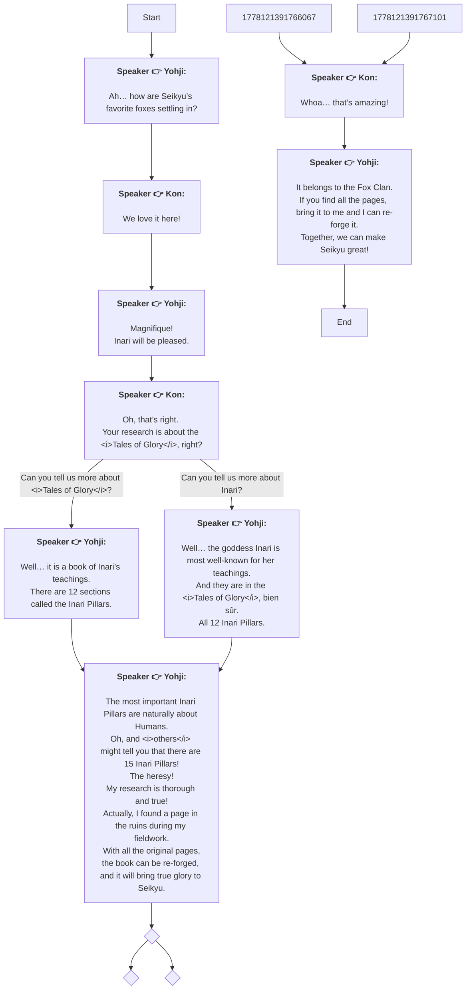

```mermaid
graph
Start -->1778121391762965[<b>Speaker 👉 Yohji:</b>
\nAh… how are Seikyu’s favorite foxes settling in?]
1778121391762965 -->1778121391763991[<b>Speaker 👉 Kon:</b>
\nWe love it here!]
1778121391763991 -->1778121391763994[<b>Speaker 👉 Yohji:</b>
\nMagnifique!
Inari will be pleased.]
1778121391763994 -->1778121391763997[<b>Speaker 👉 Kon:</b>
\nOh, that’s right. 
Your research is about the &lt;i&gt;Tales of Glory&lt;/i&gt;, right?]
1778121391763997 -->|Can you tell us more about &lt;i&gt;Tales of Glory&lt;/i&gt;?|1778121391765029[<b>Speaker 👉 Yohji:</b>
\nWell… it is a book of Inari’s teachings.
There are 12 sections called the Inari Pillars.]
1778121391763997 -->|Can you tell us more about Inari?|1778121391768131[<b>Speaker 👉 Yohji:</b>
\nWell… the goddess Inari is most well-known for her teachings.
And they are in the &lt;i&gt;Tales of Glory&lt;/i&gt;, bien sûr.
All 12 Inari Pillars.]
1778121391765029 -->1778121391765032[<b>Speaker 👉 Yohji:</b>
\nThe most important Inari Pillars are naturally about Humans.\nOh, and &lt;i&gt;others&lt;/i&gt; might tell you that there are 15 Inari Pillars!
The heresy!
My research is thorough and true!\nActually, I found a page in the ruins during my fieldwork.
With all the original pages,
the book can be re-forged, and it will bring true glory to Seikyu.]
1778121391765032 -->1778121391766061{ }
1778121391766061 -->1778121391766064{ }
1778121391766061 -->1778121391767105{ }
1778121391766067 -->1778121391766070[<b>Speaker 👉 Kon:</b>
\nWhoa… that’s amazing!]
1778121391766070 -->1778121391767097[<b>Speaker 👉 Yohji:</b>
\nIt belongs to the Fox Clan.
If you find all the pages, bring it to me and I can re-forge it.
Together, we can make Seikyu great!]
1778121391767097 -->1778121391767100[End]
1778121391767101 -->1778121391766070[<b>Speaker 👉 Kon:</b>
\nWhoa… that’s amazing!]
1778121391768131 -->1778121391765032[<b>Speaker 👉 Yohji:</b>
\nThe most important Inari Pillars are naturally about Humans.\nOh, and &lt;i&gt;others&lt;/i&gt; might tell you that there are 15 Inari Pillars!
The heresy!
My research is thorough and true!\nActually, I found a page in the ruins during my fieldwork.
With all the original pages,
the book can be re-forged, and it will bring true glory to Seikyu.]

```