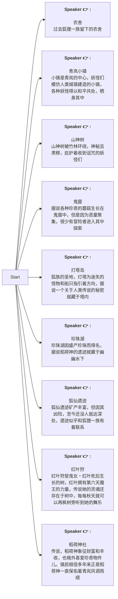

```mermaid
graph LR
Start -->1774189677612389[<b>Speaker 👉 :</b>
\n农舍
过去狐狸一族留下的农舍]
Start -->1774189691757927[<b>Speaker 👉 :</b>
\n青岚小镇
小镇是青岚的中心，妖怪们模仿人类城镇建造的小镇，各种妖怪得以和平共处，栖身其中]
Start -->1774189705340265[<b>Speaker 👉 :</b>
\n山神树
山神树被竹林环绕，神秘且肃穆，庇护着收到诅咒的妖怪们]
Start -->1774189719104875[<b>Speaker 👉 :</b>
\n鬼窟
据说各种珍奇的蘑菇生长在鬼窟中，但是因为恶童聚集，很少有冒险者进入其中探索]
Start -->1774189780885869[<b>Speaker 👉 :</b>
\n灯塔岛
狐族的圣地，灯塔为迷失的怪物和船只指引着方向，据说一个关于人类传说的秘密就藏于塔内]
Start -->1774189828753775[<b>Speaker 👉 :</b>
\n珍珠湖
珍珠湖因盛产珍珠而得名，据说稻荷神的遗迹就藏于幽幽水下]
Start -->1774189835710833[<b>Speaker 👉 :</b>
\n狐仙遗迹
狐仙遗迹矿产丰富，但因其凶险，至今还没人抵达深处，遗迹似乎和狐狸一族有着联系]
Start -->1774190276512115[<b>Speaker 👉 :</b>
\n红叶狩
红叶狩是鬼女・红叶死后生长的树，红叶拥有第六天魔王的力量，传说她的灵魂还存在于树中，每每秋天就可以再枫树旁听到她的舞乐]
Start -->1774190287572341[<b>Speaker 👉 :</b>
\n稻荷神社
传说，稻荷神象征财富和丰收，也格外喜爱珍奇物件儿。镇民相信多年来正是稻荷神一直保佑着青岚风调雨顺]

```