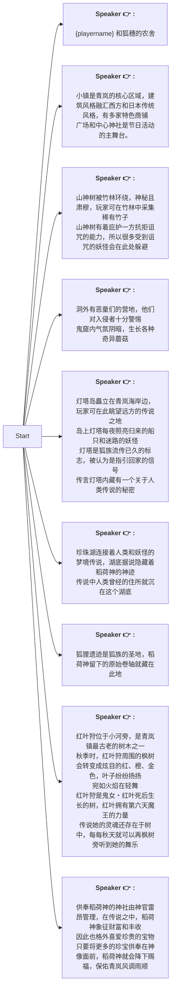

```mermaid
graph LR
Start -->1773857195941183[<b>Speaker 👉 :</b>
\n&lbrace;playername&rbrace; 和狐穗的农舍]
Start -->1773857442925891[<b>Speaker 👉 :</b>
\n小镇是青岚的核心区域，建筑风格融汇西方和日本传统风格，有多家特色商铺\n广场和中心神社是节日活动的主舞台。]
Start -->1773857482260806[<b>Speaker 👉 :</b>
\n山神树被竹林环绕，神秘且肃穆，玩家可在竹林中采集稀有竹子\n山神树有着庇护一方抗拒诅咒的能力，所以很多受到诅咒的妖怪会在此处躲避]
Start -->1773857565319497[<b>Speaker 👉 :</b>
\n洞外有恶童们的营地，他们对入侵者十分警惕\n鬼窟内气氛阴暗，生长各种奇异蘑菇]
Start -->1773857617143116[<b>Speaker 👉 :</b>
\n灯塔岛矗立在青岚海岸边，玩家可在此眺望远方的传说之地
岛上灯塔每夜照亮归来的船只和迷路的妖怪\n灯塔是狐族流传已久的标志，被认为是指引回家的信号
传言灯塔内藏有一个关于人类传说的秘密]
Start -->1773857702381903[<b>Speaker 👉 :</b>
\n珍珠湖连接着人类和妖怪的梦境传说，湖底据说隐藏着稻荷神的神迹\n传说中人类曾经的住所就沉在这个湖底]
Start -->1773857754189138[<b>Speaker 👉 :</b>
\n狐狸遗迹是狐族的圣地，稻荷神留下的原始卷轴就藏在此地]
Start -->1773857821073749[<b>Speaker 👉 :</b>
\n红叶狩位于小河旁，是青岚镇最古老的树木之一
秋季时，红叶狩周围的枫树会转变成炫目的红、橙、金色，叶子纷纷扬扬
宛如火焰在轻舞\n红叶狩是鬼女・红叶死后生长的树，红叶拥有第六天魔王的力量\n传说她的灵魂还存在于树中，每每秋天就可以再枫树旁听到她的舞乐]
Start -->1773857873172824[<b>Speaker 👉 :</b>
\n供奉稻荷神的神社由神官雷昂管理，在传说之中，稻荷神象征财富和丰收
因此也格外喜爱珍贵的宝物
只要将更多的珍宝供奉在神像面前，稻荷神就会降下赐福，保佑青岚风调雨顺]

```