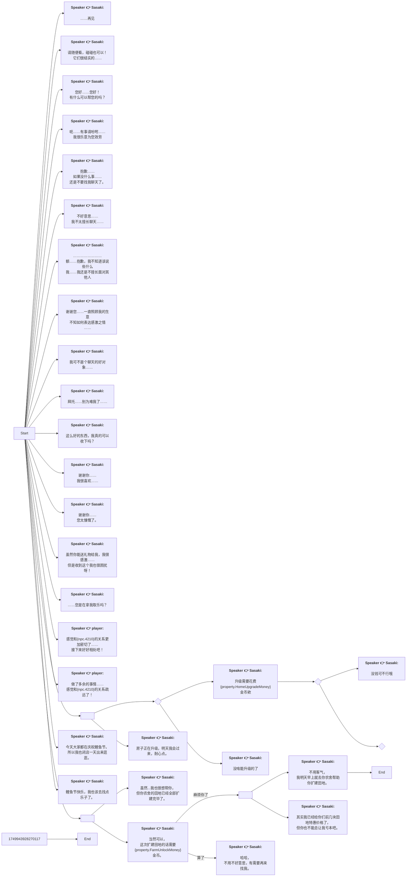

```mermaid
graph LR
Start -->1727397700216937[<b>Speaker 👉 Sasaki:</b>
\n……再见]
Start -->1727397947972715[<b>Speaker 👉 Sasaki:</b>
\n请随便看，碰碰也可以！
它们很结实的……]
Start -->1727397947972717[<b>Speaker 👉 Sasaki:</b>
\n您好……您好！
有什么可以帮您的吗？]
Start -->1727397947973743[<b>Speaker 👉 Sasaki:</b>
\n呃……有事请吩咐……
我很乐意为您效劳]
Start -->1727398269267067[<b>Speaker 👉 Sasaki:</b>
\n抱歉……
如果没什么事……
还是不要找我聊天了。]
Start -->1727398269267069[<b>Speaker 👉 Sasaki:</b>
\n不好意思……
我不太擅长聊天……]
Start -->1727398269268095[<b>Speaker 👉 Sasaki:</b>
\n……………………\n额……抱歉，我不知道该说些什么
我……我还是不擅长面对其他人]
Start -->1727398269268097[<b>Speaker 👉 Sasaki:</b>
\n谢谢您……一直照顾我的生意
不知如何表达感激之情
……]
Start -->1727398269268099[<b>Speaker 👉 Sasaki:</b>
\n我可不是个聊天的好对象……]
Start -->1727398269269125[<b>Speaker 👉 Sasaki:</b>
\n拜托……别为难我了……]
Start -->1727398879386759[<b>Speaker 👉 Sasaki:</b>
\n这么好的东西，我真的可以收下吗？]
Start -->1727398879386761[<b>Speaker 👉 Sasaki:</b>
\n谢谢你……
我很喜欢……]
Start -->1727398879387787[<b>Speaker 👉 Sasaki:</b>
\n谢谢你……
您太慷慨了。]
Start -->1727398879387789[<b>Speaker 👉 Sasaki:</b>
\n虽然你能送礼物给我，我很感激……
但是收到这个我也很困扰呀！]
Start -->1727398879387791[<b>Speaker 👉 Sasaki:</b>
\n……您是在拿我取乐吗？]
Start -->1727398879387793[<b>Speaker 👉 player:</b>
\n感觉和&lbrace;npc.4210&rbrace;的关系更加密切了……
接下来好好相处吧！]
Start -->1727398879388819[<b>Speaker 👉 player:</b>
\n做了多余的事情……
感觉和&lbrace;npc.4210&rbrace;的关系疏远了！]
Start -->1774503360995699[ ]
1774503360995699 -->1772616658178249{ }
1774503360995699 -->1774504769440115[<b>Speaker 👉 Sasaki:</b>
\n房子正在升级，明天我会过来，耐心点。]
1772616658178249 -->1749600078779689[<b>Speaker 👉 Sasaki:</b>
\n升级需要花费&lbrace;property.HomeUpgradeMoney&rbrace;金币欸]
1772616658178249 -->1772616798014667[<b>Speaker 👉 Sasaki:</b>
\n没啥能升级的了]
1749600078779689 -->1772616720144586{ }
1772616720144586 -->1772616838618316[<b>Speaker 👉 Sasaki:</b>
\n没钱可不行哦]
1772616720144586 -->1772614890779848{ }
1749943928270117 -->1772614785208517[End]
Start -->1753051243282237[<b>Speaker 👉 Sasaki:</b>
\n今天大家都在庆祝鲤鱼节，所以我也闭店一天出来逛逛。]
Start -->1753053061347134[<b>Speaker 👉 Sasaki:</b>
\n鲤鱼节快乐，我也该去找点乐子了。]
Start -->1772513504355483[ ]
1772513504355483 -->1772512731238547[<b>Speaker 👉 Sasaki:</b>
\n虽然...我也很想帮你，
但你农舍的田地已经全部扩建完毕了。]
1772513504355483 -->1772512731235472[<b>Speaker 👉 Sasaki:</b>
\n当然可以，
这次扩建田地的话需要&lbrace;property.FarmUnlockMoney&rbrace;金币。]
1772512731235472 -->|麻烦你了|1772513491075226[ ]
1772512731235472 -->|算了|1772597373706480[<b>Speaker 👉 Sasaki:</b>
\n哈哈，
不用不好意思，有需要再来找我。]
1772513491075226 -->1772512731239572[<b>Speaker 👉 Sasaki:</b>
\n不用客气，
我明天早上就去你农舍帮助你扩建田地。]
1772513491075226 -->1772512731237522[<b>Speaker 👉 Sasaki:</b>
\n其实我已经给你们前几块田地特惠价格了，
但你也不能总让我亏本吧。]
1772512731239572 -->1772597220497642[End]

```