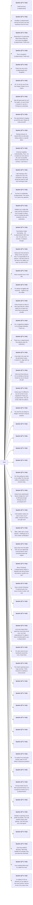

```mermaid
graph LR
Start -->1775339980319086[<b>Speaker 👉 Yohji:</b>
\nUntill tomorrow, &lbrace;c.playername&rbrace;.]
Start -->1775339980319090[<b>Speaker 👉 Yohji:</b>
\nGoodbye, &lbrace;c.playername&rbrace; and let me know if you find anything in the fox ruins!]
Start -->1775339980319094[<b>Speaker 👉 Yohji:</b>
\nStupendous! I'm quite picky about these things but you've got me pegged, &lbrace;c.playername&rbrace;. Thank you!]
Start -->1775339980319098[<b>Speaker 👉 Yohji:</b>
\nThis is wonderful, &lbrace;c.playername&rbrace;. Thank you!]
Start -->1775339980319102[<b>Speaker 👉 Yohji:</b>
\nThank you very much, &lbrace;c.playername&rbrace;.Very thoughtful.]
Start -->1775339980319106[<b>Speaker 👉 Yohji:</b>
\nAh, it's not my cup of tea, but maybe I'll pass it on to Liliana.]
Start -->1775339980319110[<b>Speaker 👉 Yohji:</b>
\nWas this gift meant for me? No matter, I'm sure I'll find &lt;i&gt;some&lt;/i&gt; use for it. Perhaps as a doorstop.]
Start -->1775339980319114[<b>Speaker 👉 Yohji:</b>
\nThe carp festival is shaping up well this year. Please do enjoy yourself!]
Start -->1775339980319118[<b>Speaker 👉 Yohji:</b>
\nSeeing everyone so cheerful fills me with pride. Seikyu really is a special place.]
Start -->1775339980319122[<b>Speaker 👉 Yohji:</b>
\nEmersion expidites understanding. Thus, I try to spend as much time at the ruins as possible. They're connected to the humans, I just know it.]
Start -->1775339980319126[<b>Speaker 👉 Yohji:</b>
\nI take Mondays off to explore the ruins. But sometimes I slip away during the week as well. Don't tell Mayor Oda!]
Start -->1775339980319130[<b>Speaker 👉 Yohji:</b>
\nNo time to confabulate, &lbrace;c.playername&rbrace;. The casino is in need of my attention.]
Start -->1775339980319134[<b>Speaker 👉 Yohji:</b>
\nKababa runs a tight ship. Look at all the commerce she's brought to seikyu, and her funding has been invaluble to the ruin exploration.]
Start -->1775339980319138[<b>Speaker 👉 Yohji:</b>
\nFascinating, simply fascinating... Oh, &lbrace;c.playername&rbrace; I didn't see you. Um, give me a moment, I'm deep in thought.]
Start -->1775339980319142[<b>Speaker 👉 Yohji:</b>
\nLiliana and I first arrived in Seikyu at this very dock. Now, I'm responsible for its citizens. I will serve them to the best of my ability, you have my word on that.]
Start -->1775339980319146[<b>Speaker 👉 Yohji:</b>
\nNever enough hours in the day.]
Start -->1775339980319150[<b>Speaker 👉 Yohji:</b>
\nI've always struggled with insomnia... maybe it's all the coffee.]
Start -->1775339980319154[<b>Speaker 👉 Yohji:</b>
\nI draw humans to relax on rainy days like this. Liliana makes fun of them but I think they're quite good actually.]
Start -->1775339980319158[<b>Speaker 👉 Yohji:</b>
\nAh, a magnificent addition to my birthday festivities. Thank you.]
Start -->1775339980319162[<b>Speaker 👉 Yohji:</b>
\nThank you, &lbrace;c.playername&rbrace;. Now please enjoy the celebration.]
Start -->1775339980319166[<b>Speaker 👉 Yohji:</b>
\nI truly hate to be rude, but this gift doesn't quite--&lt;i&gt;ahem&lt;/i&gt;--align with my values.]
Start -->1775339980319170[<b>Speaker 👉 Yohji:</b>
\nYohji must have told you it's my birthday at the last minute for you to choose this gift.]
Start -->1775339980319174[<b>Speaker 👉 Yohji:</b>
\nLiliana says I'm difficult to buy for but this is truly magnificent! Thank you, &lbrace;c.playername&rbrace;. This will surely make her jealous.]
Start -->1775339980319178[<b>Speaker 👉 Yohji:</b>
\nYou and Kon are always a delight. Feel free to stop by anytime.]
Start -->1775339980319182[<b>Speaker 👉 Yohji:</b>
\n-]
Start -->1775339980319186[<b>Speaker 👉 Yohji:</b>
\n-]
Start -->1775339980319190[<b>Speaker 👉 Yohji:</b>
\n-]
Start -->1775339980319194[<b>Speaker 👉 Yohji:</b>
\n-]
Start -->1775339980319198[<b>Speaker 👉 Yohji:</b>
\nDo I like putting ice cubes in my coffee? No. But iced coffee is inevitable in this Summer heat.]
Start -->1775339980319202[<b>Speaker 👉 Yohji:</b>
\nLiliana loves watching the leaves change but I can't sit still long enough. Perhaps you can accompany her?]
Start -->1775339980319206[<b>Speaker 👉 Yohji:</b>
\nCold weather makes me crave a warm cup of coffee. Should we have one right now?]
Start -->1775339980319210[<b>Speaker 👉 Yohji:</b>
\nBitter coffee with a sweet dessert, I challenge you to find a better combination!]
Start -->1775339980319214[<b>Speaker 👉 Yohji:</b>
\nSpicy food ruins the pallet. How can you appreciate nuanced flavors when everything tastes like rubber!]
Start -->1775339980319218[<b>Speaker 👉 Yohji:</b>
\nMerry Christmas, &lbrace;c.playername&rbrace;! Seikyu is beautiful with all the festive decorations, wouldn't you say?]
Start -->1775339980319222[<b>Speaker 👉 Yohji:</b>
\nHave a lovely Christmas! I'm going to get a few hours of work in while I still can!]
Start -->1775339980319226[<b>Speaker 👉 Yohji:</b>
\n-]
Start -->1775339980319230[<b>Speaker 👉 Yohji:</b>
\n-]
Start -->1775339980319234[<b>Speaker 👉 Yohji:</b>
\nLeon and Liliana think I spend too much time at the ruins. Isn't that preposterous? I'm glad to have a kindred spirit in you, &lbrace;c.playername&rbrace;.]
Start -->1775339980319238[<b>Speaker 👉 Yohji:</b>
\nI've seen some of your handiwork around the ruins. Good show.]
Start -->1775339980319242[<b>Speaker 👉 Yohji:</b>
\nThe Casino opening was a huge success. I think everyone is starting to come around.]
Start -->1775339980319246[<b>Speaker 👉 Yohji:</b>
\n-]
Start -->1775339980319250[<b>Speaker 👉 Yohji:</b>
\n-]
Start -->1775339980319254[<b>Speaker 👉 Yohji:</b>
\n-]
Start -->1775339980319258[<b>Speaker 👉 Yohji:</b>
\n-]
Start -->1775339980319262[<b>Speaker 👉 Yohji:</b>
\n-]
Start -->1775339980319266[<b>Speaker 👉 Yohji:</b>
\n-]
Start -->1775339980319270[<b>Speaker 👉 Yohji:</b>
\nYui asked if my head gets sweaty under my hat... What a rediculous question!]
Start -->1775339980319274[<b>Speaker 👉 Yohji:</b>
\n-]
Start -->1775339980319278[<b>Speaker 👉 Yohji:</b>
\nHumans thank Inari for their autumnal harvest. It is a auspicous season isn't it, &lbrace;c.playername&rbrace;?]
Start -->1775339980319282[<b>Speaker 👉 Yohji:</b>
\n-]
Start -->1775339980319286[<b>Speaker 👉 Yohji:</b>
\nKababa is reporting record profits this Winter. The cold weather keeps yokai playing. I bet she'd give you a free game.]
Start -->1775339980319290[<b>Speaker 👉 Yohji:</b>
\n-]
Start -->1777905516468690[<b>Speaker 👉 Yohji:</b>
\nI don't like artificial flavoring. Take Ninja bubbles for example, they just taste like chemicals.]
Start -->1777906400800214[<b>Speaker 👉 Yohji:</b>
\nI love reading before bed. It's settles the mind.]
Start -->1777906889286106[<b>Speaker 👉 Yohji:</b>
\nI'm asking Yui for an advance on my salary to buy new furniture. Decore is one of my many vices.]

```