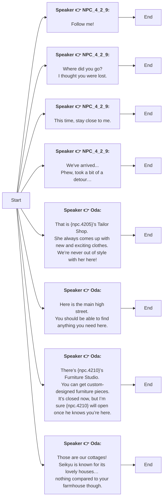

```mermaid
graph LR
Start -->1769066131689535[<b>Speaker 👉 NPC_4_2_9:</b>
\nFollow me!]
1769066131689535 -->1769066092872766[End]
Start -->1769066146257985[<b>Speaker 👉 NPC_4_2_9:</b>
\nWhere did you go?
I thought you were lost.]
1769066146257985 -->1769066146257986[End]
Start -->1769066149276740[<b>Speaker 👉 NPC_4_2_9:</b>
\nThis time, stay close to me.]
1769066149276740 -->1769066149276741[End]
Start -->1769066151519303[<b>Speaker 👉 NPC_4_2_9:</b>
\nWe've arrived...
Phew, took a bit of a detour…]
1769066151519303 -->1769066151519304[End]
Start -->1772598517553340[<b>Speaker 👉 Oda:</b>
\nThat is &lbrace;npc.4205&rbrace;’s Tailor Shop. 
She always comes up with new and exciting clothes. 
We’re never out of style with her here!]
1772598517553340 -->1772344589943011[End]
Start -->1772598505930939[<b>Speaker 👉 Oda:</b>
\nHere is the main high street. 
You should be able to find anything you need here.]
1772598505930939 -->1772344576162017[End]
Start -->1772598518761661[<b>Speaker 👉 Oda:</b>
\nThere’s &lbrace;npc.4210&rbrace;’s Furniture Studio. 
You can get custom-designed furniture pieces.
It’s closed now, but I’m sure &lbrace;npc.4210&rbrace; will open once he knows you’re here.]
1772598518761661 -->1772344746521829[End]
Start -->1772598520089790[<b>Speaker 👉 Oda:</b>
\nThose are our cottages! 
Seikyu is known for its lovely houses… 
nothing compared to your farmhouse though.]
1772598520089790 -->1772344760857831[End]

```