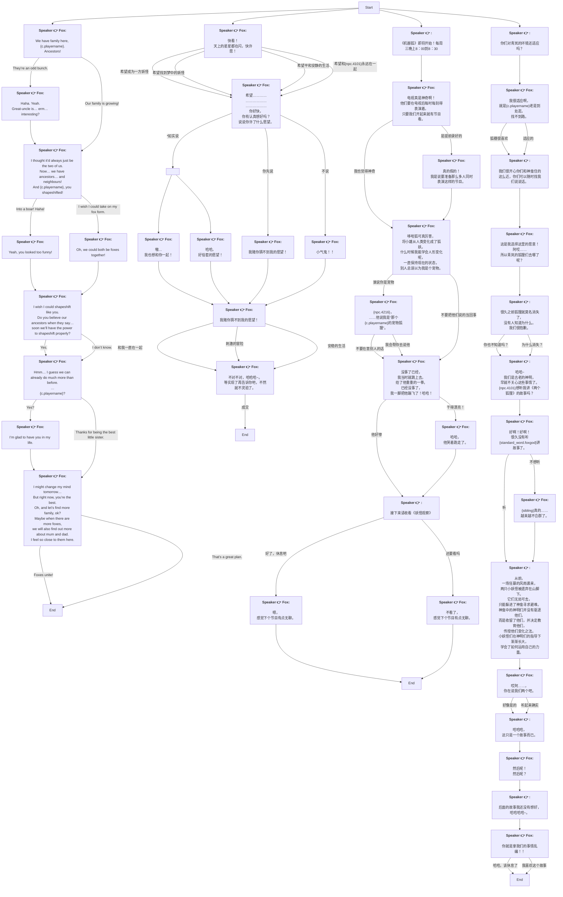

```mermaid
graph
Start -->1751644127271263[<b>Speaker 👉 Fox:</b>
\nWe have family here, &lbrace;c.playername&rbrace;.
Ancestors!]
1751644127271263 -->|They’re an odd bunch.|1751644159856997[<b>Speaker 👉 Fox:</b>
\nHaha. Yeah.
Great-uncle is… erm… interesting?]
1751644127271263 -->|Our family is growing!|1751644216324455[<b>Speaker 👉 Fox:</b>
\nI thought it’d always just be the two of us.
Now… we have ancestors… and neighbours!\nAnd &lbrace;c.playername&rbrace;, you shapeshifted!]
1751644159856997 -->1751644216324455[<b>Speaker 👉 Fox:</b>
\nI thought it’d always just be the two of us.
Now… we have ancestors… and neighbours!\nAnd &lbrace;c.playername&rbrace;, you shapeshifted!]
1751644216324455 -->|Into a boar! Haha!|1751644301407597[<b>Speaker 👉 Fox:</b>
\nYeah, you looked too funny!]
1751644216324455 -->|I wish I could take on my fox form.|1776856979865197[<b>Speaker 👉 Fox:</b>
\nOh, we could both be foxes together!]
1751644301407597 -->1776857044826736[<b>Speaker 👉 Fox:</b>
\nI wish I could shapeshift like you.\nDo you believe our ancestors when they say…
soon we’ll have the power to shapeshift properly?]
1776857044826736 -->|Yes.|1751644380024179[<b>Speaker 👉 Fox:</b>
\nHmm… I guess we can already do much more than before.\n…
&lbrace;c.playername&rbrace;?]
1776857044826736 -->|I don’t know.|1751644380024179[<b>Speaker 👉 Fox:</b>
\nHmm… I guess we can already do much more than before.\n…
&lbrace;c.playername&rbrace;?]
1751644380024179 -->|Yes?|1772507203294762[<b>Speaker 👉 Fox:</b>
\nI’m glad to have you in my life.]
1751644380024179 -->|Thanks for being the best little sister.|1776857688945267[<b>Speaker 👉 Fox:</b>
\nI might change my mind tomorrow…
But right now, you’re the best.\nOh, and let’s find more family, ok?\nMaybe when there are more foxes,
we will also find out more about mum and dad.
I feel so close to them here.]
1772507203294762 -->1776857688945267[<b>Speaker 👉 Fox:</b>
\nI might change my mind tomorrow…
But right now, you’re the best.\nOh, and let’s find more family, ok?\nMaybe when there are more foxes,
we will also find out more about mum and dad.
I feel so close to them here.]
1776857688945267 -->|Foxes unite!|1751644039353691[End]
1776857688945267 -->|That’s a great plan.|1751644039353691[End]
1776856979865197 -->1776857044826736[<b>Speaker 👉 Fox:</b>
\nI wish I could shapeshift like you.\nDo you believe our ancestors when they say…
soon we’ll have the power to shapeshift properly?]
Start -->1751644562807161[<b>Speaker 👉 Fox:</b>
\n快看！
天上的星星都在闪，快许愿！]
1751644562807161 -->|希望成为一方妖怪|1751644617870723[<b>Speaker 👉 Fox:</b>
\n希望…………
………………
………………\n你好快，
你有认真想好吗？
说说你许了什么愿望。]
1751644562807161 -->|希望找到梦中的妖怪|1751644617870723[<b>Speaker 👉 Fox:</b>
\n希望…………
………………
………………\n你好快，
你有认真想好吗？
说说你许了什么愿望。]
1751644562807161 -->|希望平和安静的生活|1751644617870723[<b>Speaker 👉 Fox:</b>
\n希望…………
………………
………………\n你好快，
你有认真想好吗？
说说你许了什么愿望。]
1751644562807161 -->|希望和&lbrace;npc.4101&rbrace;永远在一起|1751644617870723[<b>Speaker 👉 Fox:</b>
\n希望…………
………………
………………\n你好快，
你有认真想好吗？
说说你许了什么愿望。]
1751644617870723 -->|*如实说|1751811201722694[ ]
1751644617870723 -->|你先说|1751645112345998[<b>Speaker 👉 Fox:</b>
\n我赌你猜不到我的愿望！]
1751644617870723 -->|不说|1751645094748557[<b>Speaker 👉 Fox:</b>
\n小气鬼！！]
1751645094748557 -->1751647480540614[<b>Speaker 👉 Fox:</b>
\n我赌你猜不到我的愿望！]
1751647480540614 -->|和我一直在一起|1751645634809239[<b>Speaker 👉 Fox:</b>
\n不对不对，哈哈哈~。
等实现了再告诉你吧，不然就不灵验了。]
1751647480540614 -->|刺激的冒险|1751645634809239[<b>Speaker 👉 Fox:</b>
\n不对不对，哈哈哈~。
等实现了再告诉你吧，不然就不灵验了。]
1751647480540614 -->|安稳的生活|1751645634809239[<b>Speaker 👉 Fox:</b>
\n不对不对，哈哈哈~。
等实现了再告诉你吧，不然就不灵验了。]
1751645634809239 -->|成交|1751644045333854[End]
1751645112345998 -->1751647480540614[<b>Speaker 👉 Fox:</b>
\n我赌你猜不到我的愿望！]
1751811201722694 -->1751647954639307[<b>Speaker 👉 Fox:</b>
\n嗷…
我也想和你一起！]
1751811201722694 -->1751645851853208[<b>Speaker 👉 Fox:</b>
\n哈哈，
好俗套的愿望！]
1751647954639307 -->1751647480540614[<b>Speaker 👉 Fox:</b>
\n我赌你猜不到我的愿望！]
1751645851853208 -->1751647480540614[<b>Speaker 👉 Fox:</b>
\n我赌你猜不到我的愿望！]
Start -->1751901329945929[<b>Speaker 👉 :</b>
\n《机器狐》即将开始！每周三晚上8：00到8：30]
1751901329945929 -->1751902804312700[<b>Speaker 👉 Fox:</b>
\n电视真是神奇啊！
他们要在电视后每时每刻得表演着，
只要我们开起来就有节目看。]
1751902804312700 -->|我也觉得神奇|1751903174455975[<b>Speaker 👉 Fox:</b>
\n哆啦狐可真厉害，
将小雄从人类变化成了狐妖。\n什么时候我能学会人形变化呢，
一直保持现在的状态，
别人总误以为我是个宠物。]
1751902804312700 -->|是提前录好的|1751903028477606[<b>Speaker 👉 Fox:</b>
\n真的假的！
我是说要准备那么多人同时表演这样的节目。]
1751903028477606 -->1751903174455975[<b>Speaker 👉 Fox:</b>
\n哆啦狐可真厉害，
将小雄从人类变化成了狐妖。\n什么时候我能学会人形变化呢，
一直保持现在的状态，
别人总误以为我是个宠物。]
1751903174455975 -->|谁说你是宠物|1752159869563231[<b>Speaker 👉 Fox:</b>
\n&lbrace;npc.4216&rbrace;，
……他说我是“那个&lbrace;c.playername&rbrace;的宠物狐狸”。]
1751903174455975 -->|不要把他们说的当回事|1752159968485728[<b>Speaker 👉 Fox:</b>
\n没事了已经，
我当时就跳上去，
给了他重重的一拳。\n已经没事了，
我一脚把他踹飞了！哈哈！]
1752159869563231 -->|不要在意别人的话|1752159968485728[<b>Speaker 👉 Fox:</b>
\n没事了已经，
我当时就跳上去，
给了他重重的一拳。\n已经没事了，
我一脚把他踹飞了！哈哈！]
1752159869563231 -->|我会帮你去说他|1752159968485728[<b>Speaker 👉 Fox:</b>
\n没事了已经，
我当时就跳上去，
给了他重重的一拳。\n已经没事了，
我一脚把他踹飞了！哈哈！]
1752159968485728 -->|他好惨|1751903578356404[<b>Speaker 👉 :</b>
\n接下来请收看《妖怪观察》]
1752159968485728 -->|干得漂亮！|1752160269715970[<b>Speaker 👉 Fox:</b>
\n哈哈，
他哭着跑走了。]
1752160269715970 -->1751903578356404[<b>Speaker 👉 :</b>
\n接下来请收看《妖怪观察》]
1751903578356404 -->|好了，休息吧|1751903630131900[<b>Speaker 👉 Fox:</b>
\n嗯，
感觉下个节目有点无聊。]
1751903578356404 -->|还要看吗|1751903625163451[<b>Speaker 👉 Fox:</b>
\n不看了，
感觉下个节目有点无聊。]
1751903630131900 -->1751903659551421[End]
1751903625163451 -->1751903659551421[End]
Start -->1752073509284287[<b>Speaker 👉 :</b>
\n你们对青岚的环境还适应吗？]
1752073509284287 -->1752073889267136[<b>Speaker 👉 Fox:</b>
\n我很适应啊，
就是&lbrace;c.playername&rbrace;老是到处逛，
找不到路。]
1752073889267136 -->|狐穗很喜欢|1752074012392902[<b>Speaker 👉 :</b>
\n我们很开心你们和神龛住的这么近，你们可以随时找我们说说话。]
1752073889267136 -->|适应的|1752074012392902[<b>Speaker 👉 :</b>
\n我们很开心你们和神龛住的这么近，你们可以随时找我们说说话。]
1752074012392902 -->1752074120758727[<b>Speaker 👉 Fox:</b>
\n这是我选择这里的愿意！\n阿哎……
所以青岚的狐狸们去哪了呢？]
1752074120758727 -->1752074153995720[<b>Speaker 👉 :</b>
\n很久之前狐狸就莫名消失了，
没有人知道为什么。
我们很抱歉。]
1752074153995720 -->|你也不知道吗？|1752074630851022[<b>Speaker 👉 :</b>
\n哈哈~
我们是古老的神明，
早就不关心这些事情了。\n&lbrace;npc.4101&rbrace;想听我讲《两个狐狸》的故事吗？]
1752074153995720 -->|为什么消失？|1752074630851022[<b>Speaker 👉 :</b>
\n哈哈~
我们是古老的神明，
早就不关心这些事情了。\n&lbrace;npc.4101&rbrace;想听我讲《两个狐狸》的故事吗？]
1752074630851022 -->1752074769008079[<b>Speaker 👉 Fox:</b>
\n好啊！好啊！
很久没有听&lbrace;standard_word.foxgod&rbrace;讲故事了。]
1752074769008079 -->|听|1752075101877718[<b>Speaker 👉 :</b>
\n从前，
一场狂暴的风雨袭来，
两只小妖怪被遗弃在山脚下。\n它们无处可去，
只能躲进了神龛寻求避难。\n神龛中的神明们并没有驱逐他们，
而是收留了他们，并决定教育他们，
传授他们变化之法。\n小妖怪们在神明们的指导下渐渐长大，
学会了如何运用自己的力量。]
1752074769008079 -->|不想听|1752075053670869[<b>Speaker 👉 Fox:</b>
\n&lbrace;sibling&rbrace;真的……
越来越不合群了。]
1752075053670869 -->1752075101877718[<b>Speaker 👉 :</b>
\n从前，
一场狂暴的风雨袭来，
两只小妖怪被遗弃在山脚下。\n它们无处可去，
只能躲进了神龛寻求避难。\n神龛中的神明们并没有驱逐他们，
而是收留了他们，并决定教育他们，
传授他们变化之法。\n小妖怪们在神明们的指导下渐渐长大，
学会了如何运用自己的力量。]
1752075101877718 -->1752075258115543[<b>Speaker 👉 Fox:</b>
\n哎阿……，
你在说我们两个吧。]
1752075258115543 -->|好像是的|1752075304066525[<b>Speaker 👉 :</b>
\n哈哈哈，
这只是一个故事而已。]
1752075258115543 -->|听起来确实|1752075304066525[<b>Speaker 👉 :</b>
\n哈哈哈，
这只是一个故事而已。]
1752075304066525 -->1752075352334814[<b>Speaker 👉 Fox:</b>
\n然后呢！
然后呢？]
1752075352334814 -->1752075371292127[<b>Speaker 👉 :</b>
\n后面的故事我还没有想好，
哈哈哈哈~。]
1752075371292127 -->1752075387700704[<b>Speaker 👉 Fox:</b>
\n你就是拿我们的事情乱编！！]
1752075387700704 -->|哈哈，该休息了|1752075435377122[End]
1752075387700704 -->|我喜欢这个故事|1752075435377122[End]

```