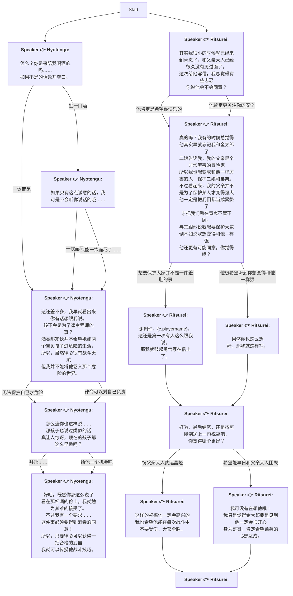

```mermaid
graph
Start -->1758605767331398[<b>Speaker 👉 Nyotengu:</b>
\n怎么？你是来陪我喝酒的吗……
如果不是的话免开尊口。]
1758605767331398 -->|抿一口酒|1758605814728268[<b>Speaker 👉 Nyotengu:</b>
\n如果只有这点诚意的话，我可是不会听你说话的哦……]
1758605767331398 -->|一饮而尽|1758606699736658[<b>Speaker 👉 Nyotengu:</b>
\n这还差不多，我早就看出来你有话想跟我说。
该不会是为了律令拜师的事？\n酒吞那家伙并不希望她那两个宝贝孩子过危险的生活，
所以，虽然律令很有战斗天赋
但我并不能将他卷入那个危险的世界。]
1758605814728268 -->|一饮而尽|1758606699736658[<b>Speaker 👉 Nyotengu:</b>
\n这还差不多，我早就看出来你有话想跟我说。
该不会是为了律令拜师的事？\n酒吞那家伙并不希望她那两个宝贝孩子过危险的生活，
所以，虽然律令很有战斗天赋
但我并不能将他卷入那个危险的世界。]
1758605814728268 -->|只能一饮而尽了……|1758606699736658[<b>Speaker 👉 Nyotengu:</b>
\n这还差不多，我早就看出来你有话想跟我说。
该不会是为了律令拜师的事？\n酒吞那家伙并不希望她那两个宝贝孩子过危险的生活，
所以，虽然律令很有战斗天赋
但我并不能将他卷入那个危险的世界。]
1758606699736658 -->|无法保护自己才危险|1758607314763352[<b>Speaker 👉 Nyotengu:</b>
\n怎么连你也这样说……
那孩子也说过类似的话
真让人惊讶，现在的孩子都这么早熟吗？]
1758606699736658 -->|律令可以对自己负责|1758607314763352[<b>Speaker 👉 Nyotengu:</b>
\n怎么连你也这样说……
那孩子也说过类似的话
真让人惊讶，现在的孩子都这么早熟吗？]
1758607314763352 -->|拜托……|1758607472497246[<b>Speaker 👉 Nyotengu:</b>
\n好吧，既然你都这么说了
看在那杯酒的份上，我就勉为其难的接受了。\n不过我有一个要求……
这件事必须要得到酒吞的同意！\n所以，只要律令可以获得一把合格的武器
我就可以传授他战斗技巧。]
1758607314763352 -->|给他一个机会吧|1758607472497246[<b>Speaker 👉 Nyotengu:</b>
\n好吧，既然你都这么说了
看在那杯酒的份上，我就勉为其难的接受了。\n不过我有一个要求……
这件事必须要得到酒吞的同意！\n所以，只要律令可以获得一把合格的武器
我就可以传授他战斗技巧。]
Start -->1761905278021897[<b>Speaker 👉 Ritsurei:</b>
\n其实我很小的时候就已经来到青岚了，和父亲大人已经很久没有见过面了。
这次给他写信，我总觉得有些忐忑
你说他会不会同意？]
1761905278021897 -->|他肯定是希望你快乐的|1761906724864272[<b>Speaker 👉 Ritsurei:</b>
\n真的吗？我有的时候总觉得他其实早就忘记我和金太郎了
二娘告诉我，我的父亲是个非常厉害的冒险家
所以我也想变成和他一样厉害的人，保护二娘和弟弟。\n不过看起来，我的父亲并不是为了保护某人才变得强大
他一定是把我们都当成累赘了
才把我们丢在青岚不管不顾。\n与其跟他说我想要保护大家倒不如说我想变得和他一样强
他还更有可能同意，你觉得呢？]
1761905278021897 -->|他肯定更关注你的安全|1761906724864272[<b>Speaker 👉 Ritsurei:</b>
\n真的吗？我有的时候总觉得他其实早就忘记我和金太郎了
二娘告诉我，我的父亲是个非常厉害的冒险家
所以我也想变成和他一样厉害的人，保护二娘和弟弟。\n不过看起来，我的父亲并不是为了保护某人才变得强大
他一定是把我们都当成累赘了
才把我们丢在青岚不管不顾。\n与其跟他说我想要保护大家倒不如说我想变得和他一样强
他还更有可能同意，你觉得呢？]
1761906724864272 -->|他很希望听到你想变得和他一样强|1761967869493942[<b>Speaker 👉 Ritsurei:</b>
\n果然你也这么想
好，那我就这样写。]
1761906724864272 -->|想要保护大家并不是一件羞耻的事|1761968607618743[<b>Speaker 👉 Ritsurei:</b>
\n谢谢你，&lbrace;c.playername&rbrace;，这还是第一次有人这么跟我说。
那我就鼓起勇气写在信上了。]
1761968607618743 -->1761968904892088[<b>Speaker 👉 Ritsurei:</b>
\n好啦，最后结尾，还是按照惯例送上一句祝福吧。
你觉得哪个更好？]
1761968904892088 -->|祝父亲大人武运昌隆|1761972478826174[<b>Speaker 👉 Ritsurei:</b>
\n这样的祝福他一定会高兴的
我也希望他能在每次战斗中不要受伤，大获全胜。]
1761968904892088 -->|希望能早日和父亲大人团聚|1761972484847295[<b>Speaker 👉 Ritsurei:</b>
\n我可没有在想他哦！
我只是觉得金太郎要是见到他一定会很开心
身为哥哥，肯定希望弟弟的心愿达成。]
1761972478826174 -->1761973301025472[<b>Speaker 👉 Ritsurei:</b>
]
1761972484847295 -->1761973301025472[<b>Speaker 👉 Ritsurei:</b>
]
1761967869493942 -->1761968904892088[<b>Speaker 👉 Ritsurei:</b>
\n好啦，最后结尾，还是按照惯例送上一句祝福吧。
你觉得哪个更好？]

```