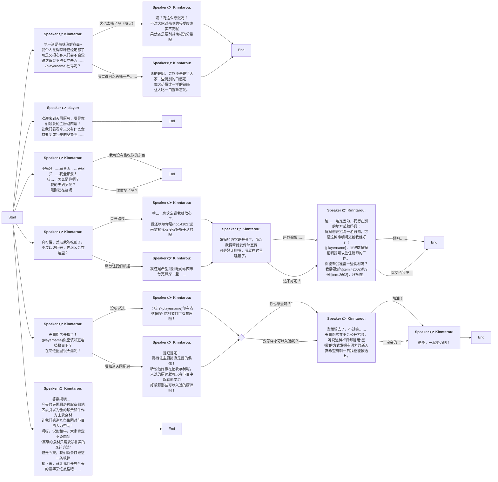

```mermaid
graph LR
Start -->1757655458919025[<b>Speaker 👉 Kinntarou:</b>
\n第一道是辣味海鲜意面~
我个人觉得辣味已经足够了
可是又担心客人们会不会觉得这道菜不够有冲击力……\n&lbrace;playername&rbrace;觉得呢？]
1757655458919025 -->|这也太辣了吧（喷火）|1757656448902775[<b>Speaker 👉 Kinntarou:</b>
\n哎？有这么夸张吗？
不过大家对辣味的接受度确实不高呢
果然还是要削减辣椒的分量呢。]
1757655458919025 -->|我觉得可以再辣一些……|1757656589291128[<b>Speaker 👉 Kinntarou:</b>
\n说的是呢，果然还是要给大家一些特别的口感吧！
像火药爆炸一样的辣感
让人吃一口就难忘呢。]
1757656448902775 -->1758962451920574[End]
1757656589291128 -->1758962451920574[End]
Start -->1757657246957178[<b>Speaker 👉 player:</b>
\n欢迎来到天国厨房，我是你们最爱的主厨路西法！
让我们看看今天又有什么食材要变成完美的圣餐呢……]
1757657246957178 -->1758962459651775[End]
Start -->1758891824335472[<b>Speaker 👉 Kinntarou:</b>
\n小笼包……乌冬面……天妇罗……我全都要！\n哎……怎么是你啊？
我的天妇罗呢？
刚刚还在这呢！]
1758891824335472 -->|我可没有偷吃你的东西|1758892125002396[End]
1758891824335472 -->|你做梦了吧？|1758892125002396[End]
439414457979296 -->|你也想去吗？|1757658446446216[<b>Speaker 👉 Kinntarou:</b>
\n当然想去了，不过嘛……
天国厨房并不会公开招收，
听说这档栏目都是用“星探”的方式发掘有潜力的新人\n真希望有朝一日我也能被选上。]
439414457979296 -->|要怎样才可以入选呢？|1757658446446216[<b>Speaker 👉 Kinntarou:</b>
\n当然想去了，不过嘛……
天国厨房并不会公开招收，
听说这档栏目都是用“星探”的方式发掘有潜力的新人\n真希望有朝一日我也能被选上。]
Start -->1758891824336501[<b>Speaker 👉 Kinntarou:</b>
\n真可惜，差点就能吃到了。
不过话说回来，你怎么会在这里？]
1758891824336501 -->|只是路过|1758891824336505[<b>Speaker 👉 Kinntarou:</b>
\n噢……你这么说我就放心了。
我还以为你是&lbrace;npc.4102&rbrace;派来监督我有没有好好干活的呢。]
1758891824336501 -->|缘分让我们相遇|1758891824338563[<b>Speaker 👉 Kinntarou:</b>
\n我还是希望跟好吃的东西缘分更深厚一些……]
1758891824336505 -->1758891824337530[<b>Speaker 👉 Kinntarou:</b>
\n妈妈的酒馆要开张了，所以我得帮她发传单宣传
可是好无聊哦，我就在这里睡着了。]
1758891824337530 -->|居然偷懒……|1758891824337534[<b>Speaker 👉 Kinntarou:</b>
\n这……这是因为，我想在别的地方帮助妈妈！
妈妈想要招聘一名厨师，可是这种事明明交给我就好了！\n&lbrace;playername&rbrace;，我得向妈妈证明我可以胜任厨师的工作。
你能帮我准备一些食材吗？
我需要2条&lbrace;item.42002&rbrace;和3份&lbrace;item.2602&rbrace;，拜托啦。]
1758891824337530 -->|这不好吧！|1758891824337534[<b>Speaker 👉 Kinntarou:</b>
\n这……这是因为，我想在别的地方帮助妈妈！
妈妈想要招聘一名厨师，可是这种事明明交给我就好了！\n&lbrace;playername&rbrace;，我得向妈妈证明我可以胜任厨师的工作。
你能帮我准备一些食材吗？
我需要2条&lbrace;item.42002&rbrace;和3份&lbrace;item.2602&rbrace;，拜托啦。]
1758891824337534 -->|好吧……|1758891824338562[End]
1758891824337534 -->|就交给我吧！|1758891824338562[End]
1758891824338563 -->1758891824337530[<b>Speaker 👉 Kinntarou:</b>
\n妈妈的酒馆要开张了，所以我得帮她发传单宣传
可是好无聊哦，我就在这里睡着了。]
Start -->1757657625870971[<b>Speaker 👉 Kinntarou:</b>
\n天国厨房开播了！
&lbrace;playername&rbrace;你应该知道这档栏目吧？
在烹饪圈里很火爆呢！]
1757657625870971 -->|没听说过|1757657831917185[<b>Speaker 👉 Kinntarou:</b>
\n：哎？&lbrace;playername&rbrace;你有点落伍啰~这档节目可有意思啦！]
1757657625870971 -->|我知道天国厨房|1757657837139586[<b>Speaker 👉 Kinntarou:</b>
\n是吧是吧！\n路西法主厨简直是我的偶像！
听说他好像在招收学员呢，
入选的厨师就可以在节目中跟着他学习\n好羡慕那些可以入选的厨师啊！]
1757657831917185 -->439414457979296{ }
1757658446446216 -->|加油！|1757658708194958[<b>Speaker 👉 Kinntarou:</b>
\n是啊，一起努力吧！]
1757658446446216 -->|一定会的！|1757658708194958[<b>Speaker 👉 Kinntarou:</b>
\n是啊，一起努力吧！]
1757658708194958 -->1758962481221313[End]
1757657837139586 -->439414457979296{ }
Start -->1758894263585440[<b>Speaker 👉 Kinntarou:</b>
\n答案揭晓……
今天的天国厨房选取京都地区最引以为傲的珍贵和牛作为主要食材
让我们感谢九条集团对节目的大力赞助！\n啊呀，说到和牛，大家肯定不免想到
“高级的食材只需要最朴实的烹饪方法”
但是今天，我们将会打破这一条铁律\n接下来，就让我们开启今天的豪华烹饪旅程吧……]
1758894263585440 -->1758962464800448[End]

```