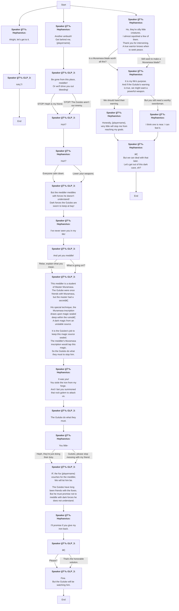

```mermaid
graph
Start -->1772337279501450[<b>Speaker 👉 Hephaestus:</b>
\nAlright, let's get to it. 
]
1772337279501450 -->1772337715382415[<b>Speaker 👉 GLP_3:</b>
\nHALT!]
1772337715382415 -->1772337430727821[End]
Start -->1772337744832656[<b>Speaker 👉 Hephaestus:</b>
\nAnother ambush! 
Get behind me, &lbrace;playername&rbrace;.
]
1772337744832656 -->1772337361612939[<b>Speaker 👉 GLP_3:</b>
\nBe gone from this place, meddler! 
Or we'll drive you out bleeding! 
]
1772337361612939 -->|STOP! Heph is my friend.|1772337815013525[<b>Speaker 👉 GLP_3:</b>
\nHuh?]
1772337361612939 -->|STOP! The Gulubo aren't our enemy. |1772337815013525[<b>Speaker 👉 GLP_3:</b>
\nHuh?]
1772337815013525 -->1772337832947862[<b>Speaker 👉 Hephaestus:</b>
\nHuh?]
1772337832947862 -->|Everyone calm down. |1772338461058204[<b>Speaker 👉 GLP_3:</b>
\nBut the meddler meddles with forces he doesn't understand!
Dark forces the Gulubo are sworn to keep at bay!
]
1772337832947862 -->|Lower your weapons.|1772338461058204[<b>Speaker 👉 GLP_3:</b>
\nBut the meddler meddles with forces he doesn't understand!
Dark forces the Gulubo are sworn to keep at bay!
]
1772338461058204 -->1772338503895197[<b>Speaker 👉 Hephaestus:</b>
\nI've never seen you in my life!]
1772338503895197 -->1772338529840286[<b>Speaker 👉 GLP_3:</b>
\nAnd yet you meddle! ]
1772338529840286 -->|Relax, explain what you mean. |1772340305297572[<b>Speaker 👉 GLP_3:</b>
\nThis meddler is a student of Master Muramasa. 
The Gulubo were once friends with Muramasa, 
but the master had a secret…
\nHis special technique, the Muramasa inscription
draws upon magic sealed deep within the ruins…
A dark magic from an unstable source. 
\nIt is the Gulubo's job to keep this magic source sealed. 
The meddler's Muramasa inscription would tap this magic. 
So the Gulubo do what they must to stop him. 
]
1772338529840286 -->|What is going on!?|1772340305297572[<b>Speaker 👉 GLP_3:</b>
\nThis meddler is a student of Master Muramasa. 
The Gulubo were once friends with Muramasa, 
but the master had a secret…
\nHis special technique, the Muramasa inscription
draws upon magic sealed deep within the ruins…
A dark magic from an unstable source. 
\nIt is the Gulubo's job to keep this magic source sealed. 
The meddler's Muramasa inscription would tap this magic. 
So the Gulubo do what they must to stop him. 
]
1772340305297572 -->1772340389143717[<b>Speaker 👉 Hephaestus:</b>
\nIt was you!
You stole the iron from my forge. 
And I bet you summoned that rock golem to attack us. 
]
1772340389143717 -->1772340420621478[<b>Speaker 👉 GLP_3:</b>
\nThe Gulubo do what they must.  ]
1772340420621478 -->1772340437280935[<b>Speaker 👉 Hephaestus:</b>
\nYou little-]
1772340437280935 -->|Heph, they're just doing their duty. |1772340486614189[<b>Speaker 👉 GLP_3:</b>
\nIF, the fox &lbrace;playername&rbrace; vouches for the meddler,
We will let him be.
\nThe Gulubo have long been friends with the foxes. 
But he must promise not to meddle with dark forces he does not understand. 
]
1772340437280935 -->|Gulubo, please stop messing with my friend.   |1772340486614189[<b>Speaker 👉 GLP_3:</b>
\nIF, the fox &lbrace;playername&rbrace; vouches for the meddler,
We will let him be.
\nThe Gulubo have long been friends with the foxes. 
But he must promise not to meddle with dark forces he does not understand. 
]
1772340486614189 -->1772340521041070[<b>Speaker 👉 Hephaestus:</b>
\nI'll promise if you give my iron back. ]
1772340521041070 -->1772340538378415[<b>Speaker 👉 GLP_3:</b>
\n…]
1772340538378415 -->|Please?|1772340569924789[<b>Speaker 👉 GLP_3:</b>
\nFine. 
But the Gulubo will be watching him. 
]
1772340538378415 -->|That's the honorable solution. |1772340569924789[<b>Speaker 👉 GLP_3:</b>
\nFine. 
But the Gulubo will be watching him. 
]
1772340569924789 -->1772340590018742[End]
Start -->1772340647472312[<b>Speaker 👉 Hephaestus:</b>
\nHo, they're silly little creatures. 
I almost squished a few of them. 
Thank you for intervening. A true warrior knows when to seek peace. 
]
1772340647472312 -->|Is a Muramasa blade worth all this?|1772340692452542[<b>Speaker 👉 Hephaestus:</b>
\nIt is my life's purpose. 
And if the Gulubo's warning is true, we might want a powerful weapon. 
]
1772340647472312 -->|Still want to make a Muramasa blade? |1772340692452542[<b>Speaker 👉 Hephaestus:</b>
\nIt is my life's purpose. 
And if the Gulubo's warning is true, we might want a powerful weapon. 
]
1772340692452542 -->|We should heed their warning.  |1772340784761029[<b>Speaker 👉 Hephaestus:</b>
\nHonestly, &lbrace;playername&rbrace;, very little will stop me from reaching my goals.
]
1772340692452542 -->|But you still need a worthy swordsman.  |1772340802653382[<b>Speaker 👉 Hephaestus:</b>
\nI think one is near. I can feel it. ]
1772340784761029 -->1772340823468231[<b>Speaker 👉 Hephaestus:</b>
\n…
But we can deal with that later. 
Let's get out of this dark cave, eh?
]
1772340823468231 -->1772340838537416[End]
1772340802653382 -->1772340823468231[<b>Speaker 👉 Hephaestus:</b>
\n…
But we can deal with that later. 
Let's get out of this dark cave, eh?
]

```