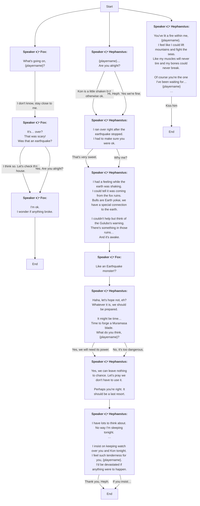

```mermaid
graph
Start -->1772344722851996[<b>Speaker 👉 Fox:</b>
\nWhat's going on, &lbrace;playername&rbrace;?
]
1772344722851996 -->|I don't know, stay close to me.  |1772344833115295[<b>Speaker 👉 Fox:</b>
\nIt's… over?
That was scary!
Was that an earthquake? 
]
1772344833115295 -->|I think so. Let's check the house.|1772344889478309[<b>Speaker 👉 Fox:</b>
\nI'm ok. 
I wonder if anything broke. 
]
1772344833115295 -->|Yes. Are you alright? |1772344889478309[<b>Speaker 👉 Fox:</b>
\nI'm ok. 
I wonder if anything broke. 
]
1772344889478309 -->1772345709070449[End]
Start -->1772345769082997[<b>Speaker 👉 Hephaestus:</b>
\n&lbrace;playername&rbrace;…
Are you alright?
]
1772345769082997 -->|Kon is a little shaken but otherwise ok. |1772345827657851[<b>Speaker 👉 Hephaestus:</b>
\nI ran over right after the earthquake stopped. 
I had to make sure you were ok. 
]
1772345769082997 -->|Hi, Heph. Yes we're fine.|1772345827657851[<b>Speaker 👉 Hephaestus:</b>
\nI ran over right after the earthquake stopped. 
I had to make sure you were ok. 
]
1772345827657851 -->|That's very sweet.|1772345884183681[<b>Speaker 👉 Hephaestus:</b>
\nI had a feeling while the earth was shaking. 
I could tell it was coming from the fox ruins. 
Bulls are Earth yokai, we have a special connection to the earth.
\nI couldn't help but think of the Gulubo's warning.
There's something in those ruins… 
And it's awake. 
]
1772345827657851 -->|Why me?|1772345884183681[<b>Speaker 👉 Hephaestus:</b>
\nI had a feeling while the earth was shaking. 
I could tell it was coming from the fox ruins. 
Bulls are Earth yokai, we have a special connection to the earth.
\nI couldn't help but think of the Gulubo's warning.
There's something in those ruins… 
And it's awake. 
]
1772345884183681 -->1772345940847746[<b>Speaker 👉 Fox:</b>
\nLike an Earthquake monster!?]
1772345940847746 -->1772345977179267[<b>Speaker 👉 Hephaestus:</b>
\nHaha, let's hope not, eh?
Whatever it is, we should be prepared. 
\nIt might be time…
Time to forge a Muramasa blade. 
What do you think, &lbrace;playername&rbrace;?
]
1772345977179267 -->|Yes, we will need its power.|1772346049252489[<b>Speaker 👉 Hephaestus:</b>
\nYes, we can leave nothing to chance. Let's pray we don't have to use it. 
\n Perhaps you're right. It should be a last resort.
]
1772345977179267 -->|No, it's too dangerous. |1772346049252489[<b>Speaker 👉 Hephaestus:</b>
\nYes, we can leave nothing to chance. Let's pray we don't have to use it. 
\n Perhaps you're right. It should be a last resort.
]
1772346049252489 -->1772346087040138[<b>Speaker 👉 Hephaestus:</b>
\nI have lots to think about. 
No way I'm sleeping tonight. 
…
\nI insist on keeping watch over you and Kon tonight. 
I feel such tenderness for you, &lbrace;playername&rbrace;. 
I'd be devastated if anything were to happen.
]
1772346087040138 -->|Thank you, Heph. |1772346140388496[End]
1772346087040138 -->|If you insist… |1772346140388496[End]
Start -->1772346469518496[<b>Speaker 👉 Hephaestus:</b>
\nYou've lit a fire within me, &lbrace;playername&rbrace;. 	
I feel like I could lift mountains and fight the seas.
Like my muscles will never tire and my bones could never break. 
\nOf course you're the one I've been waiting for…
&lbrace;playername&rbrace;
…
]
1772346469518496 -->|Kiss him|1772346579194021[End]

```