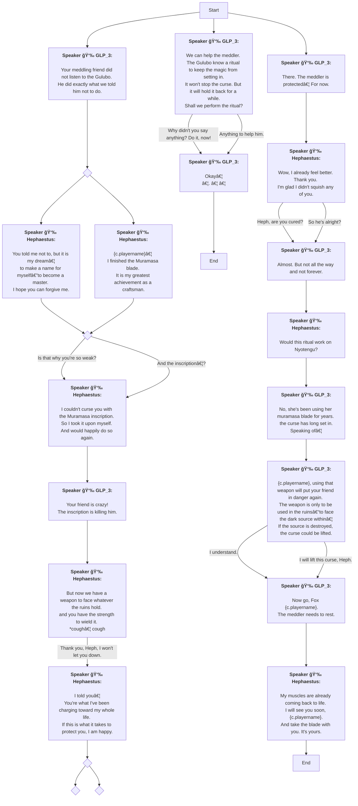

```mermaid
graph
Start -->1772508511454665[<b>Speaker 👉 GLP_3:</b>
\nYour meddling friend did not listen to the Gulubo. 
He did exactly what we told him not to do.]
1772508511454665 -->1772508621408716{ }
1772508621408716 -->1772508587055563[<b>Speaker 👉 Hephaestus:</b>
\nYou told me not to, but it is my dream…
to make a name for myself—to become a master. 
I hope you can forgive me.]
1772508621408716 -->1772508549424586[<b>Speaker 👉 Hephaestus:</b>
\n&lbrace;c.playername&rbrace;… 
I finished the Muramasa blade. 
It is my greatest achievement as a craftsman.]
1772508587055563 -->443127146763890{ }
1772509546421720 -->1772509588979161[<b>Speaker 👉 GLP_3:</b>
\nYour friend is crazy! 
The inscription is killing him.]
1772509588979161 -->1772509617017306[<b>Speaker 👉 Hephaestus:</b>
\nBut now we have a weapon to face whatever the ruins hold. 
and you have the strength to wield it. 
*cough… cough]
1772509617017306 -->|Thank you, Heph, I won't let you down.|1772509693489632[<b>Speaker 👉 Hephaestus:</b>
\nI told you…
You're what I've been charging toward my whole life. 
If this is what it takes to protect you, I am happy.]
1772509693489632 -->1772509885710818{ }
1772509885710818 -->1772509924378084{ }
1772509885710818 -->1772509946076651{ }
1772508549424586 -->443127146763890{ }
Start -->1772510017487346[<b>Speaker 👉 GLP_3:</b>
\nWe can help the meddler. 
The Gulubo know a ritual to keep the magic from setting in.
It won't stop the curse. But it will hold it back for a while.\nShall we perform the ritual?]
1772510017487346 -->|Why didn't you say anything? Do it, now!|1772510092729848[<b>Speaker 👉 GLP_3:</b>
\nOkay…
…. … …]
1772510017487346 -->|Anything to help him.|1772510092729848[<b>Speaker 👉 GLP_3:</b>
\nOkay…
…. … …]
1772510092729848 -->1772510119813625[End]
Start -->1772510155588091[<b>Speaker 👉 GLP_3:</b>
\nThere. The meddler is protected… For now.]
1772510155588091 -->1772510175331836[<b>Speaker 👉 Hephaestus:</b>
\nWow, I already feel better. 
Thank you. 
I'm glad I didn't squish any of you.]
1772510175331836 -->|Heph, are you cured?|1772510225055234[<b>Speaker 👉 GLP_3:</b>
\nAlmost. But not all the way and not forever.]
1772510175331836 -->|So he's alright?|1772510225055234[<b>Speaker 👉 GLP_3:</b>
\nAlmost. But not all the way and not forever.]
1772510225055234 -->1772510249708035[<b>Speaker 👉 Hephaestus:</b>
\nWould this ritual work on Nyotengu?]
1772510249708035 -->1772510277314052[<b>Speaker 👉 GLP_3:</b>
\nNo, she's been using her muramasa blade for years. 
the curse has long set in.
Speaking of…]
1772510277314052 -->1772510307908101[<b>Speaker 👉 GLP_3:</b>
\n&lbrace;c.playername&rbrace;, using that weapon will put your friend in danger again. 
The weapon is only to be used in the ruins–to face the dark source within…\nIf the source is destroyed, the curse could be lifted.]
1772510307908101 -->|I understand.|1772510350461451[<b>Speaker 👉 GLP_3:</b>
\nNow go, Fox &lbrace;c.playername&rbrace;.	
The meddler needs to rest.]
1772510307908101 -->|I will lift this curse, Heph.|1772510350461451[<b>Speaker 👉 GLP_3:</b>
\nNow go, Fox &lbrace;c.playername&rbrace;.	
The meddler needs to rest.]
1772510350461451 -->1772510374802956[<b>Speaker 👉 Hephaestus:</b>
\nMy muscles are already coming back to life. 
I will see you soon, &lbrace;c.playername&rbrace;.
And take the blade with you. It's yours.]
1772510374802956 -->1772510408566285[End]
443127146763890 -->|Is that why you're so weak?|1772509546421720[<b>Speaker 👉 Hephaestus:</b>
\nI couldn't curse you with the Muramasa inscription. 
So I took it upon myself. 
And would happily do so again.]
443127146763890 -->|And the inscription…?|1772509546421720[<b>Speaker 👉 Hephaestus:</b>
\nI couldn't curse you with the Muramasa inscription. 
So I took it upon myself. 
And would happily do so again.]

```