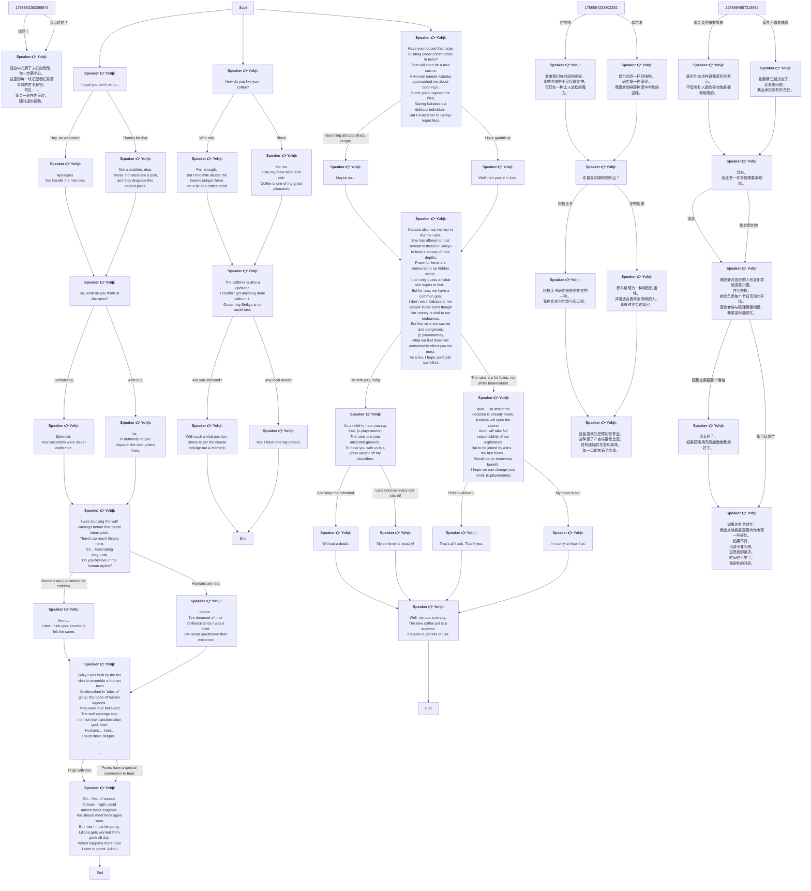

```mermaid
graph
Start -->1772864835218705[<b>Speaker 👉 Yohji:</b>
\nI hope you don't mind…]
1772864835218705 -->|Hey, he was mine!|1772864878092567[<b>Speaker 👉 Yohji:</b>
\nApologies. 
You handle the next one.]
1772864835218705 -->|Thanks for that.|1772864895442200[<b>Speaker 👉 Yohji:</b>
\nNot a problem, dear.
Those monsters are a pain,
and they disgrace this sacred place.]
1772864878092567 -->1772864921075993[<b>Speaker 👉 Yohji:</b>
\nSo, what do you think of the ruins?]
1772864921075993 -->|Stimulating!|1772864962315551[<b>Speaker 👉 Yohji:</b>
\nSplendid. 
Your ancestors were clever craftsmen.]
1772864921075993 -->|A bit dull.|1772864985090336[<b>Speaker 👉 Yohji:</b>
\nHa.  
I'll definitely let you dispatch the next golem then.]
1772864962315551 -->1772865005611297[<b>Speaker 👉 Yohji:</b>
\nI was studying the wall carvings before that beast interrupted. 
There's so much history here.
It's… fascinating.\nMay I ask,
Do you believe in the human myths?]
1772865005611297 -->|Humans are just stories for children.|1772865138406697[<b>Speaker 👉 Yohji:</b>
\nHmm…
I don't think your ancestors felt the same.]
1772865005611297 -->|Humans are real.|1772865082715431[<b>Speaker 👉 Yohji:</b>
\nI agree… 
I've dreamed of their brilliance since I was a child. 
I've never questioned their existence.]
1772865082715431 -->1772865159103786[<b>Speaker 👉 Yohji:</b>
\nSeikyu was built by the fox clan to resemble a human town
As described in 'tales of glory', the book of human legends. 
They were true believers.\nThe wall carvings also mention the transformation god, Inari.
Humans… Inari…
I must delve deeper…\n…
…
…]
1772865159103786 -->|I'll go with you.|1772865231638832[<b>Speaker 👉 Yohji:</b>
\nOh—Yes, of course. 
A foxes insight could unlock these enigmas. 
We should meet here again soon.\nBut now I must be going. 
Liliana gets worried if I'm gone all day. 
Which happens more than I care to admit. Adieu!]
1772865159103786 -->|Foxes have a special connection to Inari.|1772865231638832[<b>Speaker 👉 Yohji:</b>
\nOh—Yes, of course. 
A foxes insight could unlock these enigmas. 
We should meet here again soon.\nBut now I must be going. 
Liliana gets worried if I'm gone all day. 
Which happens more than I care to admit. Adieu!]
1772865231638832 -->1758884109455922[End]
1772865138406697 -->1772865159103786[<b>Speaker 👉 Yohji:</b>
\nSeikyu was built by the fox clan to resemble a human town
As described in 'tales of glory', the book of human legends. 
They were true believers.\nThe wall carvings also mention the transformation god, Inari.
Humans… Inari…
I must delve deeper…\n…
…
…]
1772864985090336 -->1772865005611297[<b>Speaker 👉 Yohji:</b>
\nI was studying the wall carvings before that beast interrupted. 
There's so much history here.
It's… fascinating.\nMay I ask,
Do you believe in the human myths?]
1772864895442200 -->1772864921075993[<b>Speaker 👉 Yohji:</b>
\nSo, what do you think of the ruins?]
1758883280268849 -->|你好！|1758884257319478[<b>Speaker 👉 Yohji:</b>
\n遗迹中充满了未知的危险，
你一定要小心，
这里的每一块石壁都记载着青岚的古老秘密。\n再见……
我会一直在你身边，
随时提供帮助。]
1758883280268849 -->|我见过你！|1758884257319478[<b>Speaker 👉 Yohji:</b>
\n遗迹中充满了未知的危险，
你一定要小心，
这里的每一块石壁都记载着青岚的古老秘密。\n再见……
我会一直在你身边，
随时提供帮助。]
Start -->1772873092835647[<b>Speaker 👉 Yohji:</b>
\nHow do you like your coffee?]
1772873092835647 -->|With milk.|1772873165186374[<b>Speaker 👉 Yohji:</b>
\nFair enough. 
But I find milk dilutes the bean's unique flavor.
I'm a bit of a coffee snob.]
1772873092835647 -->|Black.|1772873302639948[<b>Speaker 👉 Yohji:</b>
\nMe too.
I like my brew deep and rich.
Coffee is one of my great pleasures.]
1772873302639948 -->1772873321662797[<b>Speaker 👉 Yohji:</b>
\nThe caffeine is also a godsend.
I couldn't get anything done without it. 
Governing Seikyu is no small task.]
1772873321662797 -->|Are you stressed?|1772873347523918[<b>Speaker 👉 Yohji:</b>
\nWith such a vital position, stress is par the course
Indulge me a moment.]
1772873321662797 -->|Any local news?|1772873365040463[<b>Speaker 👉 Yohji:</b>
\nYes, I have one big project.]
1772873347523918 -->1758887035399783[End]
1772873365040463 -->1758887035399783[End]
1772873165186374 -->1772873321662797[<b>Speaker 👉 Yohji:</b>
\nThe caffeine is also a godsend.
I couldn't get anything done without it. 
Governing Seikyu is no small task.]
1758884233802292 -->|经常喝|1758884667160128[<b>Speaker 👉 Yohji:</b>
\n看来我们有相同的爱好。
我觉得咖啡不仅仅是提神，
它还有一种让人放松的魔力。]
1758884233802292 -->|偶尔喝|1758884671638081[<b>Speaker 👉 Yohji:</b>
\n偶尔品尝一杯好咖啡，
确实是一种享受。
我喜欢咖啡那种苦中带甜的滋味。]
1758884667160128 -->1758884728618567[<b>Speaker 👉 Yohji:</b>
\n你最喜欢哪种咖啡豆？]
1758884728618567 -->|阿拉比卡|1758886115369549[<b>Speaker 👉 Yohji:</b>
\n阿拉比卡确实是很受欢迎的一种。
我也喜欢它的香气和口感。]
1758884728618567 -->|罗布斯塔|1758886129579598[<b>Speaker 👉 Yohji:</b>
\n罗布斯塔有一种特别的苦味，
非常适合喜欢浓咖啡的人。
我有时也会选择它。]
1758886115369549 -->1758886211370575[<b>Speaker 👉 Yohji:</b>
\n我最喜欢的是耶加雪菲豆。
这种豆子产自埃塞俄比亚，具有独特的花香和果味，
每一口都充满了惊喜。]
1758886129579598 -->1758886211370575[<b>Speaker 👉 Yohji:</b>
\n我最喜欢的是耶加雪菲豆。
这种豆子产自埃塞俄比亚，具有独特的花香和果味，
每一口都充满了惊喜。]
1758884671638081 -->1758884728618567[<b>Speaker 👉 Yohji:</b>
\n你最喜欢哪种咖啡豆？]
Start -->1772873380276561[<b>Speaker 👉 Yohji:</b>
\nHave you noticed that large building under construction in town?
That will soon be a new casino.
A woman named Kababa approached me about opening it.\nSome yokai oppose the idea,
Saying Kababa is a dubious individual. 
But I invited her to Seikyu regardless.]
1772873380276561 -->|Gambling attracts shady people.|1772873436073303[<b>Speaker 👉 Yohji:</b>
\nMaybe so…]
1772873380276561 -->|I love gambling!|1772873446368600[<b>Speaker 👉 Yohji:</b>
\nWell then you're in luck.]
1772873436073303 -->1772873466546521[<b>Speaker 👉 Yohji:</b>
\nKababa also has interest in the fox ruins.
She has offered to host several festivals in Seikyu 
to fund a survey of their depths.\nPowerful items are rumoured to be hidden within. 
I can only guess at what she hopes to find…
But for now, we have a common goal.\nI don't want Kababa or her people in the ruins though
Her money is vital to our endeavour,
But the ruins are sacred and dangerous.\n&lbrace;c.playername&rbrace;,
what we find there will undoubtably effect you the most. 
As a fox, I hope you'll join our effort.]
1772873466546521 -->|I'm with you, Yohji.|1772873555402079[<b>Speaker 👉 Yohji:</b>
\nIt's a relief to hear you say that, &lbrace;c.playername&rbrace;.
The ruins are your ancestral grounds. 
To have you with us is a great weight off my shoulders.]
1772873466546521 -->|The ruins are for foxes, not shifty bookmakers.|1772873572184416[<b>Speaker 👉 Yohji:</b>
\nWell… I'm afraid the decision is already made. 
Kababa will open the casino 
And I will take full responsibility of our exploration.\nBut to be joined by a fox… the last foxes…
Would be an enormous benefit. 
I hope we can change your mind, &lbrace;c.playername&rbrace;.]
1772873555402079 -->|Just keep me informed.|1772873649337707[<b>Speaker 👉 Yohji:</b>
\nWithout a doubt.]
1772873555402079 -->|Let's uncover every last secret!|1772873662337388[<b>Speaker 👉 Yohji:</b>
\nMy sentiments exactly!]
1772873649337707 -->1772873703765359[<b>Speaker 👉 Yohji:</b>
\nWell, my cup is empty. 
The new coffee pot is a success.
It's sure to get lots of use.]
1772873703765359 -->1772873715788144[End]
1772873662337388 -->1772873703765359[<b>Speaker 👉 Yohji:</b>
\nWell, my cup is empty. 
The new coffee pot is a success.
It's sure to get lots of use.]
1772873572184416 -->|I'll think about it.|1772873674469741[<b>Speaker 👉 Yohji:</b>
\nThat's all I ask. Thank you.]
1772873572184416 -->|My heart is set.|1772873685037422[<b>Speaker 👉 Yohji:</b>
\nI'm sorry to hear that.]
1772873674469741 -->1772873703765359[<b>Speaker 👉 Yohji:</b>
\nWell, my cup is empty. 
The new coffee pot is a success.
It's sure to get lots of use.]
1772873685037422 -->1772873703765359[<b>Speaker 👉 Yohji:</b>
\nWell, my cup is empty. 
The new coffee pot is a success.
It's sure to get lots of use.]
1772873446368600 -->1772873466546521[<b>Speaker 👉 Yohji:</b>
\nKababa also has interest in the fox ruins.
She has offered to host several festivals in Seikyu 
to fund a survey of their depths.\nPowerful items are rumoured to be hidden within. 
I can only guess at what she hopes to find…
But for now, we have a common goal.\nI don't want Kababa or her people in the ruins though
Her money is vital to our endeavour,
But the ruins are sacred and dangerous.\n&lbrace;c.playername&rbrace;,
what we find there will undoubtably effect you the most. 
As a fox, I hope you'll join our effort.]
1758884987319882 -->|那会变得很有意思|1758886394263127[<b>Speaker 👉 Yohji:</b>
\n能听到你这样说我感到很开心，
不是所有人都会喜欢赌婆婆和赌场的。]
1758884987319882 -->|我并不喜欢赌博|1758886397992536[<b>Speaker 👉 Yohji:</b>
\n抱歉我已经决定了，
如果出问题，
我会承担所有的责任。]
1758886394263127 -->1758886525130329[<b>Speaker 👉 Yohji:</b>
\n其实，
我还有一件事情需要麻烦你。]
1758886525130329 -->|请说|1758886838010464[<b>Speaker 👉 Yohji:</b>
\n赌婆婆对遗迹的人形变化卷轴很感兴趣，
作为交换，
她会负责每个节日活动的开销。\n变化卷轴与狐狸惺惺相惜，
我希望你能帮忙。]
1758886525130329 -->|我会帮忙的|1758886838010464[<b>Speaker 👉 Yohji:</b>
\n赌婆婆对遗迹的人形变化卷轴很感兴趣，
作为交换，
她会负责每个节日活动的开销。\n变化卷轴与狐狸惺惺相惜，
我希望你能帮忙。]
1758886838010464 -->|狐穗也需要那个卷轴|1758887038982760[<b>Speaker 👉 Yohji:</b>
\n那太好了，
如果狐穗用完后能借给我就好了。]
1758886838010464 -->|我可以帮忙|1758887077784169[<b>Speaker 👉 Yohji:</b>
\n如果你愿意帮忙，
我会从赌婆婆那里为你争取一些好处。\n如果不行，
也请不要为难。
这是我的请求。\n时间也不早了，
谢谢你的时间。]
1758887038982760 -->1758887077784169[<b>Speaker 👉 Yohji:</b>
\n如果你愿意帮忙，
我会从赌婆婆那里为你争取一些好处。\n如果不行，
也请不要为难。
这是我的请求。\n时间也不早了，
谢谢你的时间。]
1758886397992536 -->1758886525130329[<b>Speaker 👉 Yohji:</b>
\n其实，
我还有一件事情需要麻烦你。]

```