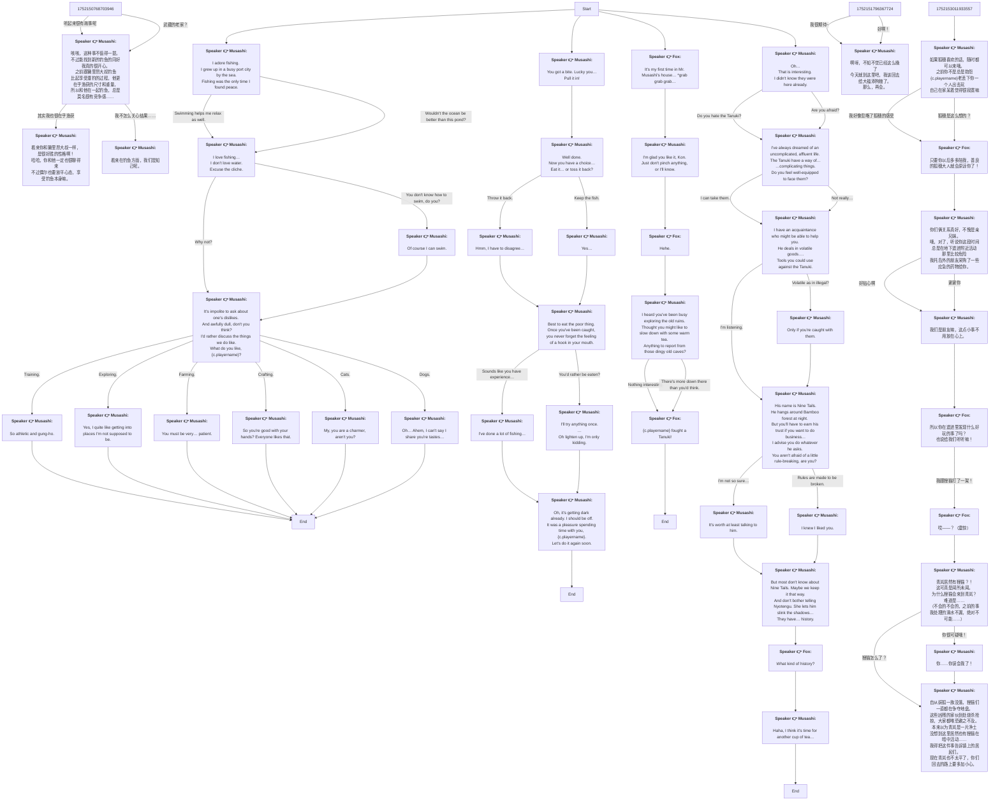

```mermaid
graph
Start -->1772879073207648[<b>Speaker 👉 Musashi:</b>
\nI adore fishing. 
I grew up in a busy port city by the sea.
Fishing was the only time I found peace.]
1772879073207648 -->|Swimming helps me relax as well.|1772879128190310[<b>Speaker 👉 Musashi:</b>
\nI love fishing…
I don't love water.
Excuse the cliche.]
1772879073207648 -->|Wouldn't the ocean be better than this pond?|1772879128190310[<b>Speaker 👉 Musashi:</b>
\nI love fishing…
I don't love water.
Excuse the cliche.]
1772879128190310 -->|Why not?|1772879207761261[<b>Speaker 👉 Musashi:</b>
\nIt's impolite to ask about one's dislikes. 
And awfully dull, don't you think?
I'd rather discuss the things we do like.\nWhat do you like, &lbrace;c.playername&rbrace;?]
1772879128190310 -->|You don't know how to swim, do you?|1772879170289004[<b>Speaker 👉 Musashi:</b>
\nOf course I can swim.]
1772879170289004 -->1772879207761261[<b>Speaker 👉 Musashi:</b>
\nIt's impolite to ask about one's dislikes. 
And awfully dull, don't you think?
I'd rather discuss the things we do like.\nWhat do you like, &lbrace;c.playername&rbrace;?]
1772879207761261 -->|Training.|1772879281482107[<b>Speaker 👉 Musashi:</b>
\nSo athletic and gung-ho.]
1772879207761261 -->|Exploring.|1772879305679228[<b>Speaker 👉 Musashi:</b>
\nYes, I quite like getting into places I'm not supposed to be.]
1772879207761261 -->|Farming.|1772879329708413[<b>Speaker 👉 Musashi:</b>
\nYou must be very… patient.]
1772879207761261 -->|Crafting.|1772879348279678[<b>Speaker 👉 Musashi:</b>
\nSo you're good with your hands? Everyone likes that.]
1772879207761261 -->|Cats.|1772879368840575[<b>Speaker 👉 Musashi:</b>
\nMy, you are a charmer, aren't you?]
1772879207761261 -->|Dogs.|1772879389115776[<b>Speaker 👉 Musashi:</b>
\nOh… Ahem, I can't say I share you're tastes…]
1772879281482107 -->1752151583964636[End]
1772879305679228 -->1752151583964636[End]
1772879329708413 -->1752151583964636[End]
1772879348279678 -->1752151583964636[End]
1772879368840575 -->1752151583964636[End]
1772879389115776 -->1752151583964636[End]
1752150768703946 -->|听起来很有故事呢|1752150972573138[<b>Speaker 👉 Musashi:</b>
\n咳咳，这种事不值得一提。
不过能找到新的钓鱼的同好我真的很开心。\n之前跟獭里昂大叔钓鱼
比起享受垂钓的过程，他更在乎渔获的尺寸和重量，
所以和他在一起钓鱼，总是莫名很有竞争感……]
1752150768703946 -->|武藏的老家？|1752150972573138[<b>Speaker 👉 Musashi:</b>
\n咳咳，这种事不值得一提。
不过能找到新的钓鱼的同好我真的很开心。\n之前跟獭里昂大叔钓鱼
比起享受垂钓的过程，他更在乎渔获的尺寸和重量，
所以和他在一起钓鱼，总是莫名很有竞争感……]
1752150972573138 -->|其实我也很在乎渔获|1752151514554843[<b>Speaker 👉 Musashi:</b>
\n看来你和獭里昂大叔一样，是很好胜的性格啊！
哈哈，你和他一定也很聊得来
不过偶尔也要放平心态，享受钓鱼本身嘛。]
1752150972573138 -->|我不怎么关心结果……|1752151483876826[<b>Speaker 👉 Musashi:</b>
\n看来在钓鱼方面，我们是知己呢。]
Start -->1772879472209281[<b>Speaker 👉 Musashi:</b>
\nYou got a bite. Lucky you…
Pull it in!]
1772879472209281 -->1772879508434306[<b>Speaker 👉 Musashi:</b>
\nWell done.
Now you have a choice…
Eat it… or toss it back?]
1772879508434306 -->|Throw it back.|1772879611500938[<b>Speaker 👉 Musashi:</b>
\nHmm, I have to disagree…]
1772879508434306 -->|Keep the fish.|1772879589331337[<b>Speaker 👉 Musashi:</b>
\nYes…]
1772879589331337 -->1772879640154507[<b>Speaker 👉 Musashi:</b>
\nBest to eat the poor thing. 
Once you've been caught, you never forget the feeling of a hook in your mouth.]
1772879640154507 -->|Sounds like you have experience…|1772879731170706[<b>Speaker 👉 Musashi:</b>
\nI've done a lot of fishing…]
1772879640154507 -->|You'd rather be eaten?|1772879698672017[<b>Speaker 👉 Musashi:</b>
\nI'll try anything once.
…\nOh lighten up, I'm only kidding.]
1772879698672017 -->1772879780944275[<b>Speaker 👉 Musashi:</b>
\nOh, it's getting dark already. I should be off.
It was a pleasure spending time with you, &lbrace;c.playername&rbrace;.
Let's do it again soon.]
1772879780944275 -->1752152968585587[End]
1772879731170706 -->1772879780944275[<b>Speaker 👉 Musashi:</b>
\nOh, it's getting dark already. I should be off.
It was a pleasure spending time with you, &lbrace;c.playername&rbrace;.
Let's do it again soon.]
1772879611500938 -->1772879640154507[<b>Speaker 👉 Musashi:</b>
\nBest to eat the poor thing. 
Once you've been caught, you never forget the feeling of a hook in your mouth.]
1752151796367724 -->|我很期待~|1752152938692978[<b>Speaker 👉 Musashi:</b>
\n啊呀，不知不觉已经这么晚了
今天就到这里吧，我该回去给大福添狗粮了。
那么，再会。]
1752151796367724 -->|好啊！|1752152938692978[<b>Speaker 👉 Musashi:</b>
\n啊呀，不知不觉已经这么晚了
今天就到这里吧，我该回去给大福添狗粮了。
那么，再会。]
Start -->1772946414205676[<b>Speaker 👉 Fox:</b>
\nIt's my first time in Mr. Musashi's house… *grab grab grab…]
1772946414205676 -->1772946436415213[<b>Speaker 👉 Musashi:</b>
\nI'm glad you like it, Kon. 
Just don't pinch anything, or I'll know.]
1772946436415213 -->1772946464551662[<b>Speaker 👉 Fox:</b>
\nHehe.]
1772946464551662 -->1772946476130031[<b>Speaker 👉 Musashi:</b>
\nI heard you've been busy exploring the old ruins. 
Thought you might like to slow down with some warm tea. 
Anything to report from those dingy old caves?]
1772946476130031 -->|Nothing interesting.|1772946528485109[<b>Speaker 👉 Fox:</b>
\n&lbrace;c.playername&rbrace; fought a Tanuki!]
1772946476130031 -->|There's more down there than you'd think.|1772946528485109[<b>Speaker 👉 Fox:</b>
\n&lbrace;c.playername&rbrace; fought a Tanuki!]
1772946528485109 -->1752154590627221[End]
1752153011933557 -->1752153046167926[<b>Speaker 👉 Musashi:</b>
\n如果狐穗喜欢的话，随时都可以来哦。
之前你不是总是抱怨&lbrace;c.playername&rbrace;老丢下你一个人出去玩
自己在家呆着觉得很寂寞嘛]
1752153046167926 -->|我好像忽略了狐穗的感受|1752153555967358[<b>Speaker 👉 Fox:</b>
\n只要你以后多多陪我，善良的狐穗大人就会原谅你了！]
1752153046167926 -->|狐穗是这么想的？|1752153555967358[<b>Speaker 👉 Fox:</b>
\n只要你以后多多陪我，善良的狐穗大人就会原谅你了！]
1752153555967358 -->1752153607355775[<b>Speaker 👉 Musashi:</b>
\n你们俩关系真好，不愧是亲兄妹。\n哦，对了，听说你这段时间总是在地下遗迹附近活动
那里比较危险
我托岛外的朋友采购了一些应急的药物给你。]
1752153607355775 -->|好贴心啊|1752153832661383[<b>Speaker 👉 Musashi:</b>
\n我们是朋友嘛，这点小事不用放在心上。]
1752153607355775 -->|谢谢你|1752153832661383[<b>Speaker 👉 Musashi:</b>
\n我们是朋友嘛，这点小事不用放在心上。]
1752153832661383 -->1752153888458120[<b>Speaker 👉 Fox:</b>
\n所以你在遗迹里发现什么好玩的事了吗？
也说给我们听听嘛！]
1752153888458120 -->|我跟狸猫打了一架！|1752153949910412[<b>Speaker 👉 Fox:</b>
\n哎——？（震惊）]
1752153949910412 -->1752153997110669[<b>Speaker 👉 Musashi:</b>
\n青岚居然有狸猫？！
这可真是闻所未闻。\n为什么狸猫会来到青岚？
难道是……
（不会的不会的，之前的事我处理的滴水不漏，绝对不可能……）]
1752153997110669 -->|狸猫怎么了？|1752154327645588[<b>Speaker 👉 Musashi:</b>
\n自从妖狐一族没落，狸猫们一直都在争夺地盘。
这些凶残的家伙到处烧杀抢掠，大家都唯恐避之不及。\n本来以为青岚是一片净土
没想到这里居然也有狸猫在暗中活动……\n我得把这件事告诉镇上的居民们。
现在青岚也不太平了，你们回去的路上要多加小心。]
1752153997110669 -->|你很可疑哦！|1752154285366675[<b>Speaker 👉 Musashi:</b>
\n你……你误会我了！]
1752154285366675 -->1752154327645588[<b>Speaker 👉 Musashi:</b>
\n自从妖狐一族没落，狸猫们一直都在争夺地盘。
这些凶残的家伙到处烧杀抢掠，大家都唯恐避之不及。\n本来以为青岚是一片净土
没想到这里居然也有狸猫在暗中活动……\n我得把这件事告诉镇上的居民们。
现在青岚也不太平了，你们回去的路上要多加小心。]
Start -->1772946565514998[<b>Speaker 👉 Musashi:</b>
\nOh…
That is interesting. 
I didn't know they were here already.]
1772946565514998 -->|Do you hate the Tanuki?|1772946605032188[<b>Speaker 👉 Musashi:</b>
\nI've always dreamed of an uncomplicated, affluent life. 
The Tanuki have a way of…
…complicating things.\nDo you feel well-equipped to face them?]
1772946565514998 -->|Are you afraid?|1772946605032188[<b>Speaker 👉 Musashi:</b>
\nI've always dreamed of an uncomplicated, affluent life. 
The Tanuki have a way of…
…complicating things.\nDo you feel well-equipped to face them?]
1772946605032188 -->|I can take them.|1772946666990338[<b>Speaker 👉 Musashi:</b>
\nI have an acquaintance who might be able to help you. 
He deals in volatile goods….
Tools you could use against the Tanuki.]
1772946605032188 -->|Not really…|1772946666990338[<b>Speaker 👉 Musashi:</b>
\nI have an acquaintance who might be able to help you. 
He deals in volatile goods….
Tools you could use against the Tanuki.]
1772946666990338 -->|I'm listening.|1772946744224521[<b>Speaker 👉 Musashi:</b>
\nHis name is Nine Tails.
He hangs around Bamboo forest at night. 
But you'll have to earn his trust if you want to do business…\nI advise you do whatever he asks. 
You aren't afraid of a little rule-breaking, are you?]
1772946666990338 -->|Volatile as in illegal?|1772946721123080[<b>Speaker 👉 Musashi:</b>
\nOnly if you're caught with them.]
1772946721123080 -->1772946744224521[<b>Speaker 👉 Musashi:</b>
\nHis name is Nine Tails.
He hangs around Bamboo forest at night. 
But you'll have to earn his trust if you want to do business…\nI advise you do whatever he asks. 
You aren't afraid of a little rule-breaking, are you?]
1772946744224521 -->|I'm not so sure…|1772946887954192[<b>Speaker 👉 Musashi:</b>
\nIt's worth at least talking to him.]
1772946744224521 -->|Rules are made to be broken.|1772946866171663[<b>Speaker 👉 Musashi:</b>
\nI knew I liked you.]
1772946887954192 -->1772946923672338[<b>Speaker 👉 Musashi:</b>
\nBut most don't know about Nine Tails. Maybe we keep it that way.
And don't bother telling Nyotengu. She lets him slink the shadows…
They have… history.]
1772946923672338 -->1772946962207507[<b>Speaker 👉 Fox:</b>
\nWhat kind of history?]
1772946962207507 -->1772946981642004[<b>Speaker 👉 Musashi:</b>
\nHaha, I think it's time for another cup of tea…]
1772946981642004 -->1752155401022872[End]
1772946866171663 -->1772946923672338[<b>Speaker 👉 Musashi:</b>
\nBut most don't know about Nine Tails. Maybe we keep it that way.
And don't bother telling Nyotengu. She lets him slink the shadows…
They have… history.]

```