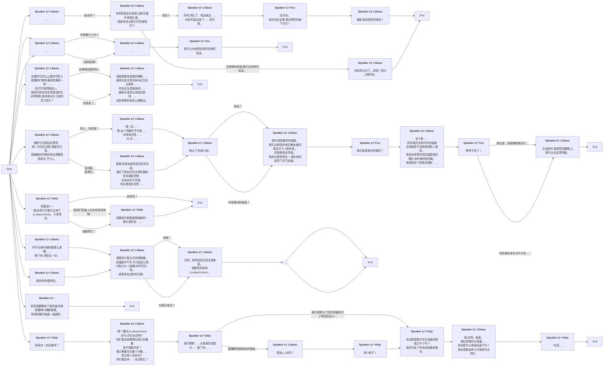

```mermaid
graph LR
Start -->1768741844007825[<b>Speaker 👉 Liliana:</b>
\n……]
1768741844007825 -->|诶,你好？|1768741949361046[<b>Speaker 👉 Liliana:</b>
\n你的花园生机勃勃,这些花盛开得很壮观。\n我能有幸记录它们的美丽吗？]
1768741949361046 -->|现在？|1768741987230620[<b>Speaker 👉 Liliana:</b>
\n好吧,失礼了。我这就走……\n你的花园太美了……真可惜。]
1768741949361046 -->|灵感稍纵即逝,我们必须抓住机会。|1768742015769501[<b>Speaker 👉 Liliana:</b>
\n你说得太对了。谢谢！我马上就开始。]
1768741987230620 -->1768742031091614[<b>Speaker 👉 Fox:</b>
\n没关系。
我也住在这里,我也赞同你画下它们！]
1768742031091614 -->1768742051441567[<b>Speaker 👉 Liliana:</b>
\n谢谢,我会很快完成的！]
1768742051441567 -->1768742061641632[End]
1768742015769501 -->1768742061641632[End]
Start -->1768742157331368[<b>Speaker 👉 Liliana:</b>
\n……]
Start -->1768742157331368[<b>Speaker 👉 Liliana:</b>
\n……]
1768742157331368 -->|你需要什么吗？|1768742200170415[<b>Speaker 👉 Liliana:</b>
\n……]
1768742157331368 -->|（保持安静）|1768742200170415[<b>Speaker 👉 Liliana:</b>
\n……]
1768742200170415 -->1768742208925616[<b>Speaker 👉 Fox:</b>
\n我不认为她现在能听到我们说话。]
1768742208925616 -->1768742179087278[End]
Start -->1768742231186354[<b>Speaker 👉 Liliana:</b>
\n我想今天就到这里吧。\n哦！你还在这里,我都没注意。\n我画画的时候经常会忽略周围发生了什么。]
1768742231186354 -->|那么…你是谁？|1768742309285816[<b>Speaker 👉 Liliana:</b>
\n哦！这……\n嗯,这个花瓣并不完美……\n光线有点暗……\n对,对……]
1768742231186354 -->|没问题。
很漂亮。|1768742316132281[<b>Speaker 👉 Liliana:</b>
\n谢谢,但是这幅作品还没有完成。\n我花了很长时间才把花瓣的形态描绘清楚。
光线也并不完美。
而且我其实还想……]
1768742309285816 -->1768742413604797[<b>Speaker 👉 Liliana:</b>
\n哦,忘了自我介绍。]
1768742413604797 -->|柴田？|1768742439759808[<b>Speaker 👉 Liliana:</b>
\n是的,我是耀司的姐姐。
我们从西部的地区搬来,耀司喜欢关于人类传说。\n但我更喜欢风景。
我师从里昂神官,一直在他的指导下学习绘画。]
1768742413604797 -->|你是耀司的姐姐？|1768742439759808[<b>Speaker 👉 Liliana:</b>
\n是的,我是耀司的姐姐。
我们从西部的地区搬来,耀司喜欢关于人类传说。\n但我更喜欢风景。
我师从里昂神官,一直在他的指导下学习绘画。]
1768742439759808 -->1768742506843073[<b>Speaker 👉 Fox:</b>
\n我们能看看你的画吗？]
1768742506843073 -->1768742518990786[<b>Speaker 👉 Liliana:</b>
\n这个嘛……
除非我完全创作完这幅画
否则我是不会随便给别人看的。\n我会在家里完成这幅素描的着色,到时候带给你看。\n我得把这个阴影处理好……]
1768742518990786 -->1768742553410499[<b>Speaker 👉 Fox:</b>
\n我等不及了！]
1768742553410499 -->|我也是。我很期待看到它。|1768742635930571[<b>Speaker 👉 Liliana:</b>
\n无论如何,感谢您的慷慨,让我可以在这里停留。]
1768742553410499 -->|阴影看起来有点不对劲……|1768742635930571[<b>Speaker 👉 Liliana:</b>
\n无论如何,感谢您的慷慨,让我可以在这里停留。]
1768742635930571 -->1768742627730378[End]
1768742316132281 -->1768742413604797[<b>Speaker 👉 Liliana:</b>
\n哦,忘了自我介绍。]
Start -->1768742809413598[<b>Speaker 👉 Liliana:</b>
\n这里的芍药比山里的芍药小\n就像他们拥有谦逊的美德一样……
但它们真的很迷人。\n那些开放在你农场周边的花非常特别,莫非和这片土地的灵力有关？]
1768742809413598 -->|这里确实很特别。|1768742892275689[<b>Speaker 👉 Liliana:</b>
\n绘画需要发现美的眼睛……\n画师应该注意到树木正在长出新芽……
甲虫正在挖掘地洞……
被雨水荡涤尘埃后的新绿……\n这些美丽的景色让我触动。]
1768742809413598 -->|你想多了。|1768742892275689[<b>Speaker 👉 Liliana:</b>
\n绘画需要发现美的眼睛……\n画师应该注意到树木正在长出新芽……
甲虫正在挖掘地洞……
被雨水荡涤尘埃后的新绿……\n这些美丽的景色让我触动。]
1768742892275689 -->1768742785701852[End]
Start -->1768742959849455[<b>Speaker 👉 Liliana:</b>
\n你不必每时每刻都那么紧绷……
慢下来,享受这一切。]
Start -->1768742988472304[<b>Speaker 👉 Liliana:</b>
\n我觉得你很特别。]
1768742959849455 -->1768742996890609[<b>Speaker 👉 Liliana:</b>
\n我很高兴能认识你和狐穗。
这幅画并不完,不过姑且让我们称之为《晨露中的芍药》吧。\n给萌芽友谊的好礼物。]
1768742996890609 -->|谢谢！|1768743033758711[<b>Speaker 👉 Liliana:</b>
\n当然。你特别的花是灵感来源。\n感谢您的款待,&lbrace;c.playername&rbrace;。]
1768742996890609 -->|对我们来说？|1768743033758711[<b>Speaker 👉 Liliana:</b>
\n当然。你特别的花是灵感来源。\n感谢您的款待,&lbrace;c.playername&rbrace;。]
1768743033758711 -->1769069908705303{ }
1769069908705303 -->1768743071508472[End]
1769069908705303 -->1768743071508472[End]
1768742988472304 -->1768742996890609[<b>Speaker 👉 Liliana:</b>
\n我很高兴能认识你和狐穗。
这幅画并不完,不过姑且让我们称之为《晨露中的芍药》吧。\n给萌芽友谊的好礼物。]
Start -->1768743183491066[<b>Speaker 👉 Yohji:</b>
\n准备战斗！
哦,你把它们都引过来了
&lbrace;c.playername&rbrace;。干得漂亮。]
1768743183491066 -->|愿我们的敌人在来世获得救赎。|1768743374785564[<b>Speaker 👉 Yohji:</b>
\n如果他们胆敢碰我姐姐的一根头发的话……]
1768743183491066 -->|莉莉奈！|1768743454079005[End]
1768743183491066 -->|谢谢帮忙！|1768743374785564[<b>Speaker 👉 Yohji:</b>
\n如果他们胆敢碰我姐姐的一根头发的话……]
1768743374785564 -->1768743454079005[End]
Start -->1768743476041759[<b>Speaker 👉 Yohji:</b>
\n莉莉奈！你没事吧？]
1768743476041759 -->1768743367756827[<b>Speaker 👉 Liliana:</b>
\n嗯？耀司,&lbrace;c.playername&rbrace;
好巧,你们也在啊？\n你们看这条攀爬在墙上的藤蔓
是不是很可爱？\n我只需要先勾勒个大概……
你们两个还好吗？
你们看起来……有点脸红？]
1768743367756827 -->1768743596140576[<b>Speaker 👉 Yohji:</b>
\n我们刚刚……从妖鬼的包围中……救了你……]
1768743596140576 -->|我们刚刚为了您的荣耀进行了神圣的战斗！|1768743683495979[<b>Speaker 👉 Yohji:</b>
\n你没发现刚才你已经身陷囹圄之中了吗？
我们打败了所有的妖鬼来救你。]
1768743596140576 -->|那棵葡萄藤看起来很棒。|1768743662149673[<b>Speaker 👉 Liliana:</b>
\n很迷人,对吧？]
1768743662149673 -->1768743676004394[<b>Speaker 👉 Yohji:</b>
\n两个疯子！]
1768743676004394 -->1768743683495979[<b>Speaker 👉 Yohji:</b>
\n你没发现刚才你已经身陷囹圄之中了吗？
我们打败了所有的妖鬼来救你。]
1768743683495979 -->1768743702583340[<b>Speaker 👉 Liliana:</b>
\n哦,好吧。谢谢。
两位英勇的大英雄……\n现在我可以继续绘画了吗？
我必须勤加练习才能创作出杰作。]
1768743702583340 -->1768743727419437[<b>Speaker 👉 Yohji:</b>
\n*叹息…]
1768743727419437 -->1768743737325614[End]
Start -->1769143900859456[<b>Speaker 👉 :</b>
\n莉莉安娜撕掉了她的画,你和狐穗睁大眼睛看着。
莉莉安娜开始画一幅新的。]
1769143900859456 -->1769143975149633[End]

```