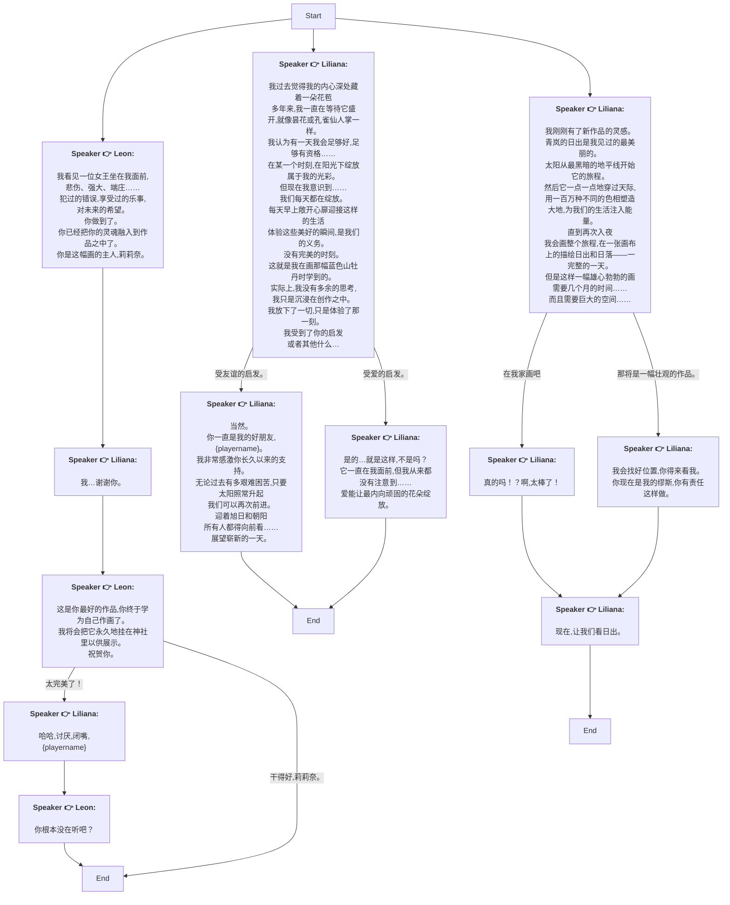

```mermaid
graph
Start -->1768792328505231[<b>Speaker 👉 Leon:</b>
\n我看见一位女王坐在我面前,悲伤、强大、端庄……\n犯过的错误,享受过的乐事,对未来的希望。\n你做到了。
你已经把你的灵魂融入到作品之中了。
你是这幅画的主人,莉莉奈。]
1768792328505231 -->1768792455003024[<b>Speaker 👉 Liliana:</b>
\n我…谢谢你。]
1768792455003024 -->1768792464139153[<b>Speaker 👉 Leon:</b>
\n这是你最好的作品,你终于学为自己作画了。\n我将会把它永久地挂在神社里以供展示。
祝贺你。]
1768792464139153 -->|太完美了！|1768792520710041[<b>Speaker 👉 Liliana:</b>
\n哈哈,讨厌,闭嘴,&lbrace;playername&rbrace;]
1768792464139153 -->|干得好,莉莉奈。|1768792549674906[End]
1768792520710041 -->1768792553789339[<b>Speaker 👉 Leon:</b>
\n你根本没在听吧？]
1768792553789339 -->1768792549674906[End]
Start -->1768792609518508[<b>Speaker 👉 Liliana:</b>
\n我过去觉得我的内心深处藏着一朵花苞
多年来,我一直在等待它盛开,就像昙花或孔雀仙人掌一样。\n我认为有一天我会足够好,足够有资格……
在某一个时刻,在阳光下绽放属于我的光彩。
但现在我意识到……\n我们每天都在绽放。
每天早上敞开心扉迎接这样的生活\n体验这些美好的瞬间,是我们的义务。
没有完美的时刻。\n这就是我在画那幅蓝色山牡丹时学到的。
实际上,我没有多余的思考,我只是沉浸在创作之中。\n我放下了一切,只是体验了那一刻。 
我受到了你的启发
或者其他什么…]
1768792609518508 -->|受友谊的启发。|1768792704609202[<b>Speaker 👉 Liliana:</b>
\n当然。
你一直是我的好朋友,&lbrace;playername&rbrace;。
我非常感激你长久以来的支持。\n无论过去有多艰难困苦,只要太阳照常升起
我们可以再次前进。\n迎着旭日和朝阳
所有人都得向前看……
展望崭新的一天。]
1768792609518508 -->|受爱的启发。|1768792953770940[<b>Speaker 👉 Liliana:</b>
\n是的…就是这样,不是吗？
它一直在我面前,但我从来都没有注意到……\n爱能让最内向顽固的花朵绽放。]
1768792704609202 -->1768793030228925[End]
1768792953770940 -->1768793030228925[End]
Start -->1768793673282495[<b>Speaker 👉 Liliana:</b>
\n我刚刚有了新作品的灵感。
青岚的日出是我见过的最美丽的。
太阳从最黑暗的地平线开始它的旅程。\n然后它一点一点地穿过天际,用一百万种不同的色相塑造大地,为我们的生活注入能量。\n直到再次入夜
我会画整个旅程,在一张画布上的描绘日出和日落——一完整的一天。\n但是这样一幅雄心勃勃的画需要几个月的时间……
而且需要巨大的空间……]
1768793673282495 -->|在我家画吧|1768793781685193[<b>Speaker 👉 Liliana:</b>
\n真的吗！？啊,太棒了！]
1768793673282495 -->|那将是一幅壮观的作品。|1768793911423946[<b>Speaker 👉 Liliana:</b>
\n我会找好位置,你得来看我。\n你现在是我的缪斯,你有责任这样做。]
1768793781685193 -->1768793937511371[<b>Speaker 👉 Liliana:</b>
\n现在,让我们看日出。]
1768793937511371 -->1768793951442892[End]
1768793911423946 -->1768793937511371[<b>Speaker 👉 Liliana:</b>
\n现在,让我们看日出。]

```