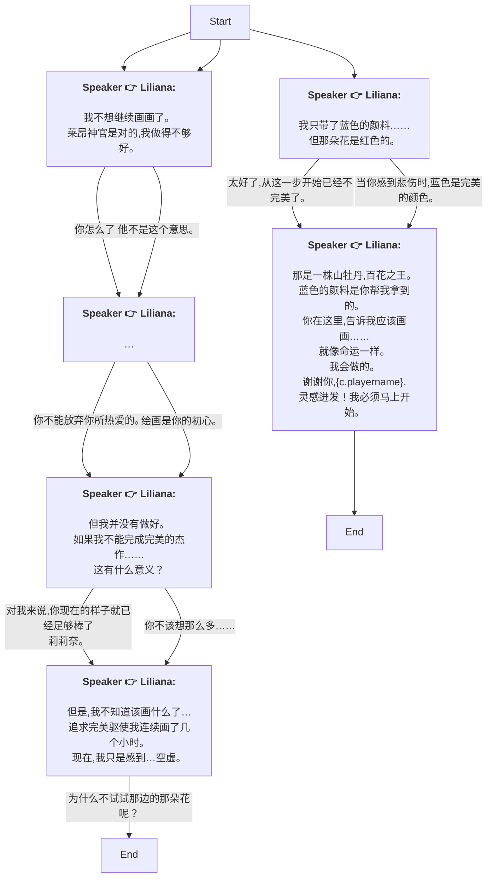

```mermaid
graph
Start -->1768791756312373[<b>Speaker 👉 Liliana:</b>
\n我不想继续画画了。
莱昂神官是对的,我做得不够好。]
Start -->1768791756312373[<b>Speaker 👉 Liliana:</b>
\n我不想继续画画了。
莱昂神官是对的,我做得不够好。]
1768791756312373 -->|你怎么了？|1768791807972160[<b>Speaker 👉 Liliana:</b>
\n…]
1768791756312373 -->|他不是这个意思。|1768791807972160[<b>Speaker 👉 Liliana:</b>
\n…]
1768791807972160 -->|你不能放弃你所热爱的。|1768791859148614[<b>Speaker 👉 Liliana:</b>
\n但我并没有做好。
如果我不能完成完美的杰作……
这有什么意义？]
1768791807972160 -->|绘画是你的初心。|1768791859148614[<b>Speaker 👉 Liliana:</b>
\n但我并没有做好。
如果我不能完成完美的杰作……
这有什么意义？]
1768791859148614 -->|对我来说,你现在的样子就已经足够棒了
莉莉奈。|1768791909076813[<b>Speaker 👉 Liliana:</b>
\n但是,我不知道该画什么了…
追求完美驱使我连续画了几个小时。\n现在,我只是感到…空虚。]
1768791859148614 -->|你不该想那么多……|1768791909076813[<b>Speaker 👉 Liliana:</b>
\n但是,我不知道该画什么了…
追求完美驱使我连续画了几个小时。\n现在,我只是感到…空虚。]
1768791909076813 -->|为什么不试试那边的那朵花呢？|1768791947847506[End]
Start -->1768791963679572[<b>Speaker 👉 Liliana:</b>
\n我只带了蓝色的颜料……
但那朵花是红色的。]
1768791963679572 -->|太好了,从这一步开始已经不完美了。|1768791991924570[<b>Speaker 👉 Liliana:</b>
\n那是一株山牡丹,百花之王。\n蓝色的颜料是你帮我拿到的。
你在这里,告诉我应该画画……\n就像命运一样。\n我会做的。
谢谢你,&lbrace;c.playername&rbrace;.\n灵感迸发！我必须马上开始。]
1768791963679572 -->|当你感到悲伤时,蓝色是完美的颜色。|1768791991924570[<b>Speaker 👉 Liliana:</b>
\n那是一株山牡丹,百花之王。\n蓝色的颜料是你帮我拿到的。
你在这里,告诉我应该画画……\n就像命运一样。\n我会做的。
谢谢你,&lbrace;c.playername&rbrace;.\n灵感迸发！我必须马上开始。]
1768791991924570 -->1768792200010587[End]

```