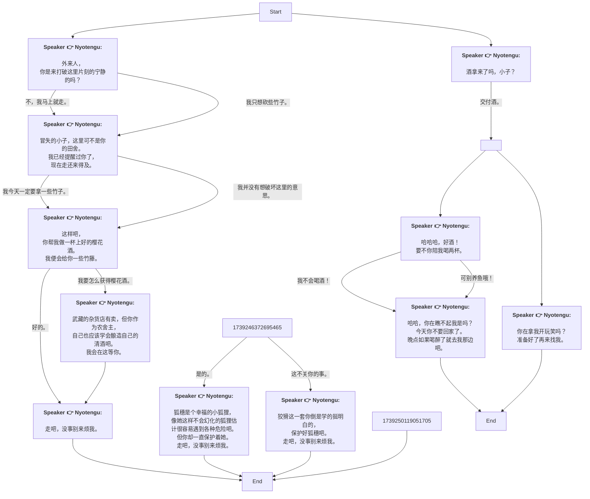

```mermaid
graph
Start -->1726167151749225[<b>Speaker 👉 Nyotengu:</b>
\n外来人，
你是来打破这里片刻的宁静的吗？]
1726167151749225 -->|不，我马上就走。|1739246235429261[<b>Speaker 👉 Nyotengu:</b>
\n冒失的小子，这里可不是你的田舍。
我已经提醒过你了，
现在走还来得及。]
1726167151749225 -->|我只想砍些竹子。|1739246235429261[<b>Speaker 👉 Nyotengu:</b>
\n冒失的小子，这里可不是你的田舍。
我已经提醒过你了，
现在走还来得及。]
1739246235429261 -->|我今天一定要拿一些竹子。|1739246340704680[<b>Speaker 👉 Nyotengu:</b>
\n这样吧，
你帮我做一杯上好的樱花酒。
我便会给你一些竹藤。]
1739246235429261 -->|我并没有想破坏这里的意思。|1739246340704680[<b>Speaker 👉 Nyotengu:</b>
\n这样吧，
你帮我做一杯上好的樱花酒。
我便会给你一些竹藤。]
1739246340704680 -->|我要怎么获得樱花酒。|1739246859444664[<b>Speaker 👉 Nyotengu:</b>
\n武藏的杂货店有卖，但你作为农舍主，
自己也应该学会酿造自己的清酒吧。
我会在这等你。]
1739246340704680 -->|好的。|1739246775566775[<b>Speaker 👉 Nyotengu:</b>
\n走吧，没事别来烦我。]
1739246775566775 -->1726173304220817[End]
1739246859444664 -->1739246775566775[<b>Speaker 👉 Nyotengu:</b>
\n走吧，没事别来烦我。]
1739246372695465 -->|这不关你的事。|1739246647790000[<b>Speaker 👉 Nyotengu:</b>
\n狡猾这一套你倒是学的挺明白的，
保护好狐穗吧。\n走吧，没事别来烦我。]
1739246372695465 -->|是的。|1739246612024751[<b>Speaker 👉 Nyotengu:</b>
\n狐穗是个幸福的小狐狸，
像她这样不会幻化的狐狸估计很容易遇到各种危险吧。\n但你却一直保护着她。\n走吧，没事别来烦我。]
1739246612024751 -->1726173304220817[End]
1739246647790000 -->1726173304220817[End]
1739250119051705 -->1726173304220817[End]
Start -->1739253161281737[<b>Speaker 👉 Nyotengu:</b>
\n酒拿来了吗，小子？]
1739253161281737 -->|交付酒。|1739253307907280[ ]
1739253307907280 -->1739253528513752[<b>Speaker 👉 Nyotengu:</b>
\n你在拿我开玩笑吗？\n准备好了再来找我。]
1739253307907280 -->1739253377374418[<b>Speaker 👉 Nyotengu:</b>
\n哈哈哈，好酒！
要不你陪我喝两杯。]
1739253377374418 -->|我不会喝酒！|1739253850175717[<b>Speaker 👉 Nyotengu:</b>
\n哈哈，你在瞧不起我是吗？
今天你不要回家了。\n晚点如果喝醉了就去我那边吧。]
1739253377374418 -->|可别养鱼哦！|1739253850175717[<b>Speaker 👉 Nyotengu:</b>
\n哈哈，你在瞧不起我是吗？
今天你不要回家了。\n晚点如果喝醉了就去我那边吧。]
1739253850175717 -->1739253372979409[End]
1739253528513752 -->1739253372979409[End]

```